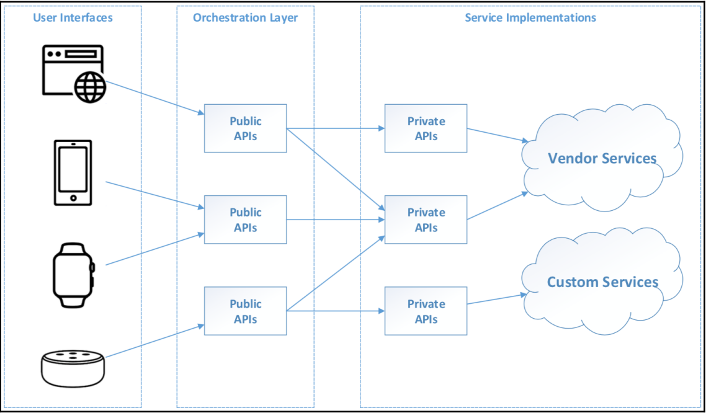
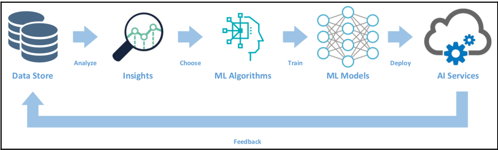
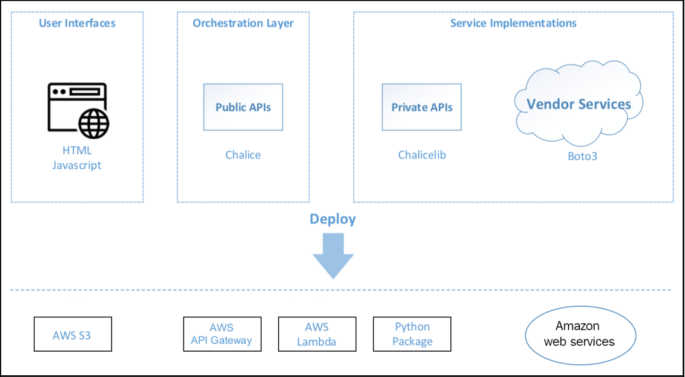
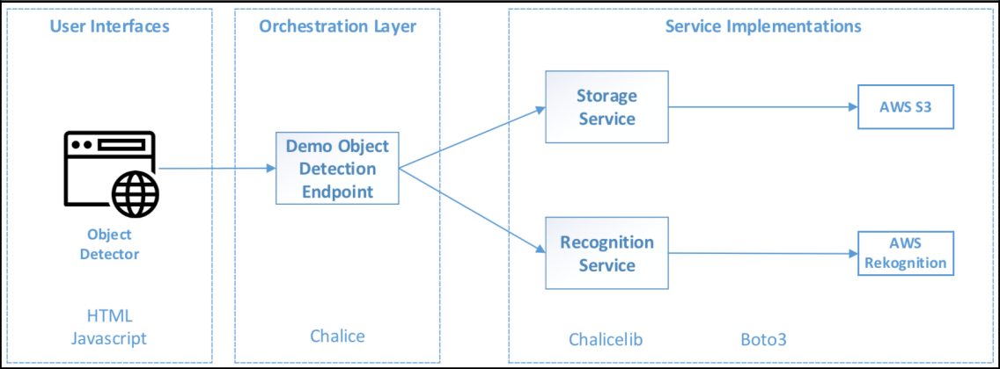
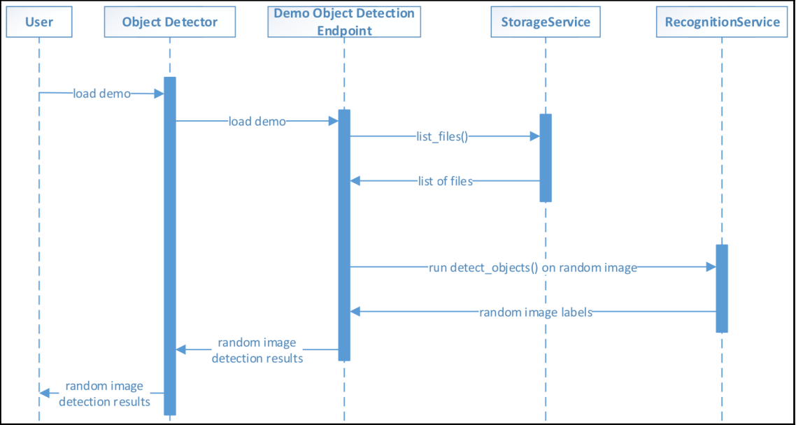

# AWS-기반-AI-애플리케이션-개발

## 02 최신 AI 애플리케이션의 구조

## AI 애플리케이션의 성공 요인
* 첫째 : 애플리케이션이 당면한 문제를 제대로 해결하는 지
* 둘째 : 해당 문제를 해결하기 위해 애플리캐이션을 얼마나 잘 개발했는 지

<!--
정확히 무엇을 만들지 결정하는 것이 더욱 즁요한 요소인데 이를 놓치면 당면한 문제에 온전한 솔루션을 제공하지 못하는 결함이 있는 제품을 만들게 된다. 결함 없는 제품을 만드는 데 아키텍처가 얼마나 훌륭한지 또는 코드베이스가 얼마나 깔끔한지는 사소한 문제이다
다만, 무엇을 만들 것인지 단번에 정획히 결정하기 어렵고 완벽한 솔루션을 미리 다 설계할 수는 없다. 또한 고객의 대부분은 자신이 무서을 원하거나 필요로 하는 지 조차 정확히 인식하지 못하기 때문에 성공적인 솔루션을 제공하려면 제품 개발, 고객 피드백 그리고 제품 요구 사항 개선 작업을 여러 차례 반복해야 한다.

반복적인 확인을 통해 솔루션을 구축하는 것(즉, 어떻게 구축할지)이 무엇을 구축해야 할지를 정확히 파악하는 데 필요한 요소인 셈이다. 애플리케이션이 단순히 동작만 하도록 하는 데는 엄청난 기술이 필요하지 않다. 때로는 갑작스런 결정과 압박에 의해 어쩔수 없이 첫번째 반복, 첫번째 버전 또는 첫버냬ㅉ 피벗을 만들기도 하는 데 이 애플리케이션은 훌륭하지 않더라도 동작은 할것이다. 그러나 첫번째 반복에서 올바른 솔루션을 도출하지 못했을 떄 더 훌륭한 아키텍처와 더욱 정갈한 코드베이스는 빠른 반복과 피벗을 유도해 무엇을 구축할 지 파악할 수 있는 더 많은 기회를 준다.
-->

---

# AI 애플리케이션의 아키텍처 설계 원칙

* 업무 기능에 따라 작은 서비스로 구성해서 애플리케이션을 설께한다. 작은 서비스는 코드 분량이 적은 것이 아니라 단일 책임의 원칙에 따라 한두 가지 업무 기능만 수행한다는 의미이다. 아울러 작은 서비스는 구현, 테스트 및 배포가 훨씬 쉽고 재사용 및 조합을 통해 새로운 업무 기능 개발이 더욱 용이하다.
* 관심사 분리가 분명하도록 애플리케이션 아키텍처의 경계를 잘 정의행 ㅑ한다. 애플리케이션을 구성하는 (작은) 서비스와 컴포넌트는 내부의 상세 구현을 숩겨서 서비승와 컴포넌트를 교체할 수 있기 때문에 솔루션의 향상과 새선이 더욱 쉬워진다.

<!--
훌륭한 애플리케이션을 구축하는 것은 어려운 문제이며 AI 분야에서는 더 그렇다. 빠르게 진화하는 AI 기술에 부합하는 애플리케이션을 구축하고 유지하기 위해서는 좋은 아키텍처 설계원칙을 이해햐고 소프트웨어 역량을 향상시키기 위해 끊임없이 훈련해야 한다. 향후 변경 사항을 모두 예축하는 것은 불가능하지만 잘 설계된 아키텍처는 변경에 쉽게 적응할 수 있기 때문에 좋은 애플리케이션 아키텍처의 기반인 표준 설계 원칙을 숙지해야 한다.

초보자로서 소프트웨어 아키텍처 설계가 좋은 나쁜지 판단하기는 어렵다. 따라서 설계의 좋고 나쁨을 판단하는 데 필요한 지식과 시술을 습득하면서 아키텍처 설께 사례를 많이 접해봐야 한다. 
-->

---

# 최신 AI 애플리케이션의 아키텍처 이해

<div class="columns">
<div class="columns-left">

* 사용자 인터페이스 계층
* 오케스트레이션 계층

</div>
<div class="columns-right">

* 비공개 API 계층
* 벤더 및 맞춤형 서비스 계층

</div>
</div>



---

## 맞춤형 AI 기능 개발

* AI 애플리케이션 개발 생명 주기
    * 솔루션의 반복(실험), 사용자 겸현 설계, 애플리케이션아키텍처 정의, 여러 업무 기능 통합
* AI 기능 개발 생명주기
    * 애플리케이션에 AI 기능, AI 서비스와 통합



<!--
이렇게 개발한 AI 기능은 AI 애플리케이션에서 핵심적인 역활을 한다. 데이터는 최근 새롭게 등장한 지적 재산이므로 기업은 이를 수집, 저장, 처리 및 보급하는 데이터 전략을 잘 세워야 한다. 원본 및 가공 데이터 집합을 데이터베이스, 데이터 레이크 및 데이터 웨어 하우스와 같은 데이터 저장 시스템에 안전하게 보존하고 사용할 수 있어야 한다. 데이터 데이터 과학자는 저정 시슽메에 이쓴ㄴ 데이터를 업무 관점으로 분석해서 예축에 이용할 인사이트를 이끌어 낸다. 이러한 인사이트를 기반으로 데이터 과학자는 적합한 머신러닝 알고리즘을 선택해서 관련 머신러닝 모형을 훈련한 뒤에 예측이나 의사 결정을 이끌어 낸다.

훌련과 조율이 끝난 머신러닝 모형에 인터페이스를 추가하면 AI 서비스로 배포할 수 있다. 예를 들어 Amazon SageMaker 는 다양한 머신러닝 모형을 훈련한 되 RESTful 엔드포인트를 설정한 웹 서비스로 배포할 수 있게 해주는 서비스이다. 마지막으로 향후에 AI 서비스를 개선할 수 있게 해당 서비스의 피드백 데이터를 수집하는 데이터 전략을 세운다.

AI 애플리케이션을 개발할 때는 우선 AWS 와 같은 벤더의 AI 서비스를 최대한 활용하기를 권고한다. 왜냐하면 출시할 머신러닝 모형을 훈련하는 데는 업청난 노력과 기술 그리고 시간이 필요하기 떄문이다. 모든 AWS AI 서비스는 대부분의 기업이 보유하지 못한 방대한 데이터로 AI 기능 개발 생명주기를 반복해서 개발했다. 한편 기밀한 데이터 자산이 있거나 벤더 솔루션으로 해결되지 않는 요구사항이 있는 경우에는 맞춤형 AI 기능을 개발하는 편이 낫다.
-->

---

# AI 애플리케이션 아키텍처에 따른 실습 준비

해당 아키텍처에 따라 실습할 때 사용할 기술과 기술 스택을 소개



* 사용자 인터페이스 계층
* 오케스트레이션 계층
* 비공개 API 계층
* 벤더 서비스

<!--
* 사용자 인터페이스 계층 : HTML, CSS 그리고 JS 를 사용해서 비교적 간단한 웹 페이지 기반의 사용자 인터페이스를 개발한다. HTML과 CSS 로 UI 구성 요소 표시 및 사용자 입력 처리를 구현하고 자바스크립트로 오케스트레이션 계층의 공개 API 를 경유해 서버 후단부와 통신한다. 실습 프로젝트의 웹페이지는 별도로 웹 서버를 두지 않고 정적 웹 사이트로 AWS S3 에 배포한다. 서버 인프라를 따라 관리할 필요가 없기 때문에 이러한 애플리케이션 배포 방식을 서버리스라 한다.
* 오케스트레이션 계층 : 이 계층에서는 파이썬 서버리스 마이크로 프레임워크인 AWS 챌리스를 사용하겠다. 챌리스는 로컬 개발 환경에서 신속하게 파이썬 애플리케이션을 개발하고 테스트해서 손쉽게 Amazon API Gateway 및 AWS Lambda 에 애플리케이션을 배포하도록 지원한다. Amazon API Gateway 는 공개 API 를 손쉡게 RESTful 엔드포인트로 제공할 수 있도록 하는 서비스로 공개 API 에 들어오는 RESTful 요청을 오케스트레이션 기능이 있는 AWS Lambda 함수에 전달한다. AWS Lambda 는 서버를 프로비저닝하거나 관리하지 않고도 코드를 실행할 수 있는 서버리스 인프라 서비스이다. 예를 들어 API 게이트웨이가 Lambda 함수를 호출하면 코드를 자동으로 트리거해 AWS 인프라에서 실행한다. 또한 이들 서비스는 무료이며 서비스 이용시에 소비한 AWS 의 컴퓨팅 자원에 대해서만 비용을 지불하면 된다.
* 비공개 API 계층 : 첼리스 프레임워크를 이용해서 비공개 API 를 파이썬 라이브러리로 패키징한다. 캘리스를 사용하면 서비스를 Chalicelib 디렉터리 안의 라이브러리로 구성할 수 있어서 모듈 단위로 개발하기 쉽다. 실습 프로젝트의 각 비공개 API 는 일반적인 파이썬 클랭스인테 서비스에 접근하기 쉽게 각 메소드 시그너처가 잘 정의돼 있다. 이 책의 실습 프로젝트에서 공개 API 와 비공개 API 간의 아키텍처 경계가 명확히 유지되도록 주의한다.
* 벤터 서비스 : 다양한 기능을 이용하기 위해 AWS 서비스를 화룡ㅇ한다. 즉 이 책의 AI 애플리케이션을 개발할 떄 AWS 의 AI 관련 서비스 외에도 기다 다양한 서비스를 사용한다. 비공개 API 는 boto3 SDK 를 통해 세부 사항을 완전히 감싸서 숩겨야 잘 설계했다고 볼 수 있으며 공개 API 는 비공개 API가 어떤 벤더 서비스 또는 맞춤형 솔루션을 사용하고 있는 지 몰라야 한다.
-->

---

# 객체 탐지기 아키텍처



---

# 객체 탐지기 컴포넌트 간의 상호작용



1. 웹 인터페이스는 객체 탐지 데모의 엔드포인트를 호출한다.
2. 엔드포인트는 특정 S3 버킷에 있는 파일의 목록을 받기 위해 스토리지 서비스를 호출한다.
3. 엔드포인트는 파일 목록을 받은 후 데모에 사용할 이미지 파일을 임의로 선택한다.
4. 엔드포인트는 선택한 이미지 파일에서 객체들을 탐지하기 위해 인식 서비스를 호출한다.
5. 엔드포인트는 객체의 레리블을 수신해 JSON 형식으로 정리한다.
6. 웹 인터페이스는 임의로 선택한 이미지 및 책체 탐지 결과를 표시한다.

---

# 기본 프로젝트 구조 생성하기

1. 터미널에서 로트 프로젝트 디렉터리를 생성하기 위해 다음 명령을 입력한다.
```
mkdir ObjectDetector
cd ObjectDetector
```

2. Website 라는 이름의 디렉터리를 생성해 웹 전단부를 저장할 공간을 만든다. 이 디렉터리 내에 다음과 같이 2개의 파일(index.html, scripts.js) 를 만든다.
```
mkdir Website
touch Website/index.html
touch Website/scripts.js
```

3. pipenv로 프로젝트의 로트 디렉터리에 파이썬 3 가상 환경을 생성한다. 프로젝트의 파이썬 코드는 2가지 패키지(boto3, chalice) 가 필요한데 다음과 같은 명령으로 설치할 수 있다.
```
pipenv --three
pipenv install boto3
pipenv install chalice
```

4. pipenv 로 설치한 파이썬 패키지는 다음 명령으로 가상 환경을 활성화 했을 떄만 사요할 수 있다.
```
pipenv shell
```

5. 가상 환경에서 다음 명령으로 오케스트레이션 계층(Capabilites 라는 이름의 AWS 챌리스 프로젝트)을 만든다.
```
chalice new-project Capabilites
```

이 명령은 ObjectDetector 디렉터리 안에 챌리스 프로젝트 구조를 생성하는 데 그 구조는 다음과 같다.

