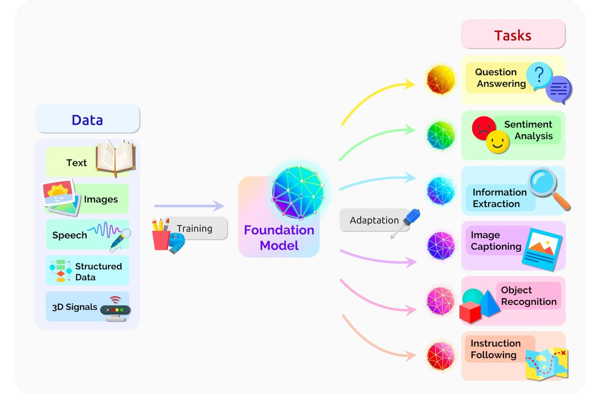
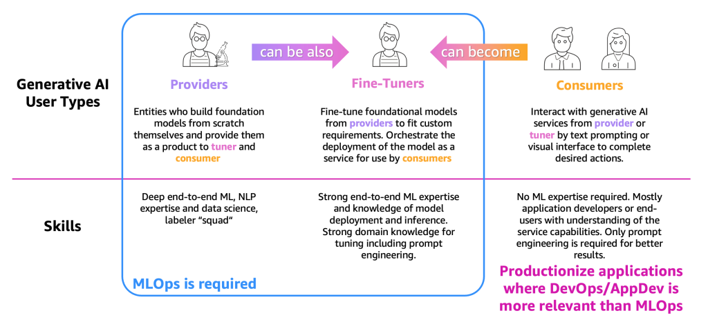
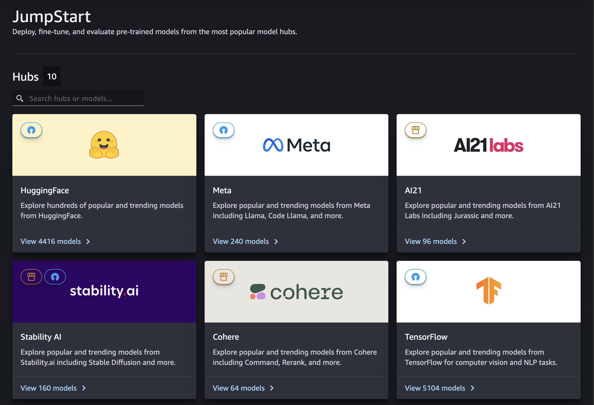
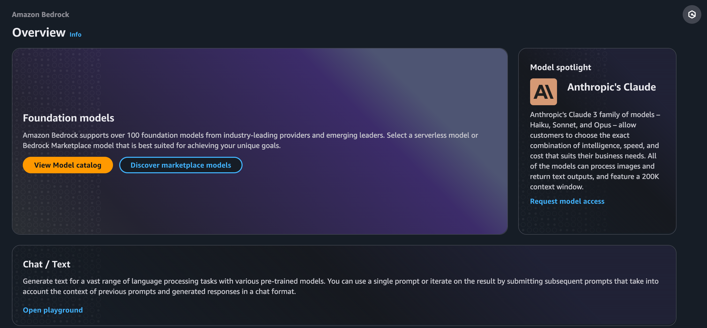

# 01. 생성형 AI 란 무엇인가?
## 1-1. 생성형 AI의 정의
생성형 AI(Generative AI) 는 새로운 콘텐츠를 창조해 내는 능력을 가진 AI 입니다. 방대한 데이터로부터 학습한 패턴과 구조를 이해하고, 이를 바탕으로 택스트, 이미지, 음악, 비디오 등 다양한 형태의 결과물을 생성합니다. 생성형 AI 는 대규모 언어 모델, 심층 신경망 그리고 고도화된 머신러닝 알고리즘을 활용하여 주어진 맥락과 지시에 따라 맞춤화된 출력을 만들어 냅니다. 이는 단순한 데이터 처리나 패턴 인식을 넘어 학습된 정보를 바탕으로 새로운 조합과 변형을 만들어 내는 능력을 의미합니다.

전통적 AI 시스템이 주로 데이터 분석, 패턴 인식, 분류 작업 등에 초점을 맞추었다면, 생성형 AI 는 새로운 콘텐츠 창조에 특화되어 있습니다. 예를 들어 기존의 AI 가 이미지를 인식하고 분류하는 데 그쳤다면 생성형 AI 는 새로운 이미지를 만들어 낼수 있습니다.

생성형 AI 는 예술, 과학, 비즈니스 등 다양한 분야에 응용되며, 인간의 창의적 작업을 보완하고 확장하는 도구로 활용되고 있습니다. 이를 통해 새로운 아이디어와 솔루션을 창출할 수 있습니다.

또한 자연어 처리, 컴퓨터 비전, 음성 합성 등 다양한 분야에서 활용되며, 지속적 연구 개발로 능력과 적용 범위가 확장되고 있습니다. 생성형 AI 기술의 발전은 인공지능 분야에서 새로운 파러다임 전환을 가져올 것으로 기대됩니다.

### 생성형 AI 의 역사와 발전
생성형 AI의 역사는 1950년대로 거슬러 올라갑니다. 이 시기에 등장한 은익 마르코프 모델(Hidden Markov Model HMM) 과 가우시안 혼합 모델(Gaussian Mixture Model) 은 생성형 AI 의 초기 형태로 주로 음성 인식과 같은 연속적인 데이터 생성에 사용되었습니다. 1960년대에는 조셉 와이젠바움(Joseph Weizenbaum) 이 ELIZA 라는 챗봇을 개발했는 데 이는 단순한 패턴 매칭과 치환 방법을 사용했지만 당시로서는 혁신적인 자연어 처리 기능이었습니다.

1980년대 후반 순환 신경망(RNN) 의 등장으로 자연어 처리 분야에 큰 진전이 있었습니다. RNN 은 시퀀스 데이터를 처리하는 데 특화된 신경망 구조로 이전의 입력을 기억하고 이를 현재의 처리에 활용할 수 있었습니다. 1997년에는 장단기 메모리(LSTM) 네트워크가 개발되어 더 긴 시퀀스의 데이터를 효과적으로 처리할 수 있게 되었습니다.

2014년 이안 굿펠로우(Ian Goodfellow) 의 생성적 적대 신경망(Generative Adversarial Network, GAN) 소개 이후 사실적인 이미지 생성이 가능해졌습니다. GAN 은 생성 모델과 판별 모델, 두개의 싱경망이 서로 경쟁하며 학습하는 방식으로 모델이 학습될수록 더우 진짜 같은 이미지를 생성할 수 있었습니다.

이후 자연어 처리 분야에서는 '사전 훈련된 언어 모델(Pre-trained Language Model)' 이 중요한 발전을 이뤘습니다. 이러한 모델들은 대규모의 텍스트 데이터를 사용하여 언어의 일반적인 패턴과 구조를 학습하며 다양한 자연어 처리 작업에 적용될 수 있는 효율성을 제공했습니다.

2017년에는 구글(Google)의 연구진이 발표한 트랜스포머(Transformer) 아키텍처가 자연어 처리 분야의 혁명적인 변화를 가져았습니다. 트랜스포머는 어텐션 메커니즘(Attention Mechanism)을 사용하여 입력 시퀀스의 모든 부분을 동시에 고려할 수 있었고 이는 이후 개발된 많은 대규모 언어 모델의 기반이 되었습니다.

기반 모델(Foundation Model) 의 학습과 적용에 대한 도식

2021년 스탠퍼드 대학ㄱ(Standford University) 의 인공지능 연구소에서 발표한 'On the Oportunityes and Risks of Foundatiaon Models' 논문은 생성형 AI 의 핵심이 되는 기반 모델(Foundation Models)  을 공식적으로 정의했습니다. 기반 모델은 사전 훈련된 언어 모델을 포함하면서도 더 넓은 범위의 모델을 아우르는 개념으로 텍스트뿐만 아니라 이미지, 오디오 등 다양한 혀익의 광범위한 데이터를 대규모로 학습하여 QnA, 감정 추출, 요약, 번역 등 아양한 하위 작업에 적용할 수 있습니다.

최근에는 멀티모달(Multi moddal) AI 의 발전이 두드러지고 있습니다. 텍스트, 이미지, 음성 등 아양한 형태의 데이터를 동시에 처리하고 생성할 수 잇는 모델들이 등장하면서 A 의 응용 범위를 크게 확장시키고 잇으며 인간의 복잡한 인지 과정을 더욱 정교하게 모방할 수 있는 가능성을 열어 주고 있습니다. 

생성형 AI 의 발전은 다양한 분야에 큰 영향을 미치고 있습니다. 예술 분야에서는 새로운 창작 도구로 활용되어 예술가들의 표현 범위를 넒히고 있으며 과학 분야에서는 신양 개발, 단백질 구조 예층 등에 활용되어 연구 속도를 가속화 하고 있습니다. 산업 분야에서는 제품 디자인, 마케팅 몬텐츠 생성, 고객 서비스 등 다양한 영역에서 활용되고 있습니다.

그러나 생성형 AI 의 발전은 저작권 문제, 딥페이크(Deepfake) 로 인한 허위 정보 확산, AI 생성 콘텐츠의 진위 판별 문제 등 여러 윤리적, 법적 문제를 야기하고 있습니다. 이러한 문제들을 해결하기 위해 기술적, 제도적 노력이 계속되고 있으며 이는 AI 기술의 지속 가능한 반전을 이ㅜ해 중요한 과제로 남아 있습니다.

### 주요 생성형 AI 모델들
2024년 12월 현재, 다음과 생성형 AI 모델들이 통용되고 있습니다.

1. GPT(Generative Pre-trained Transformer)
오픈AI(OpenAI)에서 개발한 대규모 언어 모델입니다. GPT-3, GPT-4 로 발전해 왔으며, 텍스트 생성, 번역, 요약, 질문과 답변 등 다양한 자연어 처리 작업을 수행할 수 있습니다. GPT-4 부터는 멀티모달 기능을 갖추어 이미지도 처리할 수 있게 되었습니다.

2. 버트(BERT)
구글(Google)에서 개발한 자연어 처리 모델로 양방향 학습을 통해 문맥을 더 잘 이해할수 있습니다. 주로 텍스트 분류, 질문 답변, 감정 분석 등의 작업에 활용됩니다.

3. 클로드(Claude)
앤쓰로픽(Anthropic) 에서 개발한 대화형 AI 모델로 운리적이고 안전한 AI 를 목표로 합니다. 다양한 작업을 수행할 수 있으며 특히 긴 문맥을 이해하고 처리하는 데 강점이 있습니다.

4. 라마(Llama)
메타(Meta)에서 개발한 오픈소스 언어 모델입니다. 다양한 크기의 모델을 제공하여 연구 및 응용 목적으로 널리 사용되고 있습니다. 

5. 달리(Dall-e)
오픈AI 에서 개발한 이미지 생성 모델로 텍스트 설명을 바탕으로 사실적인 이미지를 생성할 수 있습니다. 달리-2는 더욱 향상된 성능을 보여 주며 높은 해상도와 사실성을 가진 이미지를 생성합니다.

6. 스테이블 디퓨전(Stable Deffusion)
스테이블리티 AI(Stablility AI) 에서 개발한 오픈소스 이미지 생성 모델입니다. 텍스트 프롬프트를 기반으로 고품질의 이미지를 생성할 수 있으며 이미지 편집 기능도 제공합니다.

7. 미드저니(Midjourney)
텍스트 프롬프트를 바탕으로 예술적인 이미지를 생성하는 AI 도구입니다. 특히 창의적이고 독특한 스타일의 이미지 생성에 강점을 보입니다.

8. 뮤즈넷(MuseNet)
오픈IA에서 개발한 음악 생성 AI로 다양한 장르와 악기의 조합으로 새로운 음악을 만들어 낼 수 있습니다.

이러한 모델들은 지속적으로 발전하고 있으며 최근에는 대규모 언어 모델을 기반으로 다양한 작업을 수행 할 수 있는 범용 AI 모델 개발에 중점을 두고 있습니다. 또한 멀티모달 AI 기술의 ㅡ발전으로 텍스트 이미지, 음성 등 다양한 데이터를 통합적으로 처리할 수 있는 모델들이 등장하고 있습니다.

이들 모델을 조함하거나 으용ㅇ하여 새로운 애플리케이션과 서비스를 만들어 내는 연구도 활발히 진행하고 있습니다. 생성형 AI 모델들의 발전은 우리의 일상 생활, 업무 방식, 창작 활동 등 다양한 분야에서 큰 변화를 가져올 것으로 기대되며 앞으로 더욱 혁신적인 모델과 응용 사례들이 등장할 것을 예상됩니다.

## 1-2. AWS 의 생성형 AI 전략
생성형 AI 의 정의와 역사를 살펴보며 생성형 AI가 인간의 생산성을 향상시키고 창의성을 촉진하는 등 인간과 기술이 서로 긴밀한 관계를 가지고 협력하고 있음을 확인했습니다. 이러한 관계가 어떠한 방식으로 발전해 왔는 지 저금 더 자세히 들여다 볼 필요가 있습니다.

지난 수십년간 데이터 과학자와 프로그래머들은 인간의 수작업을 줄이고 복잡한 작업을 자동화하는 기술 개발에 주력해 왔습니다. 특히 AI와 머신러닝 기술의 등장으로 이 분야는 급속한 발전을 이루었습니다. 이러한 성장의 핵심에는 대량의 데이터가 있었으며 GPT 와 같은 대규모 언어 모델을 훈련시키기 우해서는 방대한 양의 데이터가 필요했습니다.

대형 언어 모델의 성능과 활용성이 부각되면서 데이터를 활용한 모델 구축과 모델을 통한 데이터 생성이 상호 보완적인 선순환 구조를 형성하게 되었습니다. 이를 통해 대규모 언어 모델은 지속적으로 발전할 수 있었고 혁신의 속도 또한 가속화되었습니다. 현재 생성형 AI 는 텍스트 생성을 넘어 이미지, 오디오, 코드 등 다양한 영역에서 인간의 창의성을 보조하고 생산성을 높이는 역활을 수행하고 있습니다.

AWS 는 이러한 순순환 구조를 가능케 하는 대표적인 플랫폼으로 다양한 GenAI AI/ML 서비스와 ㅏㅁ께 데이터 스토리지, 분석, 시각화, 컴퓨팅등 모델 구축과 학습을 위한 종합적인 인프라를ㄹ 제공하고 있습니다. 이를 통해 AWS 는 생성형 AI 개발과 운영에 필요한 모든 요소를 아우르는 완전한 생태계를 구축하고 있습니다.

이러한 생태계 내에서 AWS 는 생성형 Ai 사용자들의 다양한 요구사항과 역활을 인식하고 이에 맞춘 전략을 수립하고 있습니다. AWS 는 생성형 AI 사용자를 크게 세가지 유형으로 분류하여 각 유형에 적합한 섭스와 도구를 제공함으로써 사용자들의 다양한 요구를 충적시키고 잇습니다.

1. 공급자(Provider)
기반 모델을 처음부터 구축하여 다른 사용자에게 제공하는 전문가들입니다. 이들은 심층적인 ML(Machine Learning, 머신러닝) 및 NLP(Natural Language Processing, 자연어 처리) 지식을 보유하고 있으며 AWS 는 이들에게 대규모 데이터 처리와 모델 훈련을 위한 고성능 콤퓨팅 리소스를 제공합니다. 

2. 미세조정자(Fine-Tunner)
공급자의 기초 모델을 특정 도메인이나 작업에 맞게 조정하는 역활을 합니다. AWS 는 이들을 위해 효율적인 모둘 튜닝 도구와 배포 솔루션을 제공하여 맞춤형 모델 개발을 지원합니다.

3. 소비자(Consumer)
개발된 AI 모델을 실제 애플리케이션에서 사용하는 최종 사용자들입니다. AWS 는 이들이 복잡한 MI, 지식 없이도 AI 기능을 쉽게 활용할 수 있도록 직관적인 인터페이스와 API 를 제공합니다.

[출처](https://aws.amazon.com/ko/blogs/machine-learning/fmops-llmops-operationalize-generative-ai-and-differences-with-mlops/)

AWS의 이러한 접근 방식은 각 사용자 유형의 특성과 요구사항을 고려한 맞춤형 솔루션을 제공함으로써 생성형 AI 기술의 접근성을 높이고 혁신을 가속화합니다. 또한, 사용자들이 필요에 따라 역활을 전환하거나 확장할 수 있는 유연성을 제공합니다.

이러한 전략을 통해 AWS 는 생성형 AI 의 개발부터 실제 활용까지 전 과정을 지언하며 다양한 산업 분야에서 AI 기술의 혁신적인 응용을 촉진하고 있습니다. 결과적으로, AWS 의 생성형 AI 전략은 기술적 진보와 실용적 활용 사이의 균형을 유지하며 더 많은 기업과 개발자들이 생성형 AI 의 잠재력을 실현할 수 있도록 돕고 있습니다.

### AWS 생성형 AI 서비스
AWS에서 생성형 AI 를 직접적으로 다루는 서비스는 크게 Amazon SageMaker와 Amazon Bedrock 두 가지로 나눌 수 있습니다. 이제 두 서비스의 차이점에 대해 살펴보겠습니다. 

1. Amazon SageMaker
Amazon SageMaker 는 2017년 출시된 AWS 의 종합적인 머신러닝 서비스입니다. 이 서비스는 개발자들이 데이터 준비부터 모델 구축, 훈련, 튜닝, 배포에 이르는 전체 머신러닝 라이프사이클을 지원하는 완전 관리형 플랫폼을 제공합니다. Amazon SageMaker 는 AutoML, 분산 훈련, 모델 튜닝  등 다양한 내장 도구를 통해 모델 성능을 최적화 할 수 있습니다. 데이터 레이블링, 알고리즘 선택, 모델 훈련, 하이퍼파라미터 튜닝, 배포, 모니터링 등 머신러닝의 모든 단계를 포괄하는 기능을 제공합니다.

Amazon SageMaker 주요 기능 중 하나인 JumpStart 는 사전 구축된 모델, 알고리즘, 솔루션을 모아둔 머신러닝 허브입니다. 이를 통해 사용자는 몇 번의 클릭만으로 뉴스 요약, 이미지 생성 등의 기능을 빠르게 배포할 수 있습니다. 사전 훈련된 모델을 자체 데이터로 추가 학습시켜 맞춤화할 수 있고 AWS 관리 콘솔이나 SDK 를 통해 프로덕션에 쉽게 배포 할 수 잇습니다. 

JupStart 에서는 AI21 Labs, Hugging Face, Stability AI 등 다양한 모델 제공업체의 공개 및 독점 모델을 활용할 수 있습니다. 이러한 모델들은 문서 요약, 텍스트/이미지/비디오 생성 등 폭넓은 작업에 적용 가능합니다. 더불어 모델과 노트북을 조직 내에서 공유함으로써 모델 구축 및 배포 과정을 가속화 할 수 있습니다.

Amazon SageMaker 는 머신러닝 전체 주기를 아우르는 통합 플랫폼이자, 최신 AI 모델을 손쉽게 활용할 수 잇는 허브 역활을 합니다. 이를 통해 사용자는 AWS 클라우으에서 머신러닝 워크로드를 간편하게 구축하고 운영할 수 있습니다.

2. Amazon Bedrock
Amazon Bedrock 은 AWS 에서 제공하는 완전 관리형의 생성형 AI 플랫폼입니다. AI21 Labs, Anthropic, Cohere, Meta, Mistral AI, Stability AI 등 선도적인 AI 기업들의 ㅡ최신 고성능 기반 모델을 단일 API 로 손쉽게 활용할 수 있습니다. 

Amazon Bedrock 의 핵심 목표는 생성형 AI 의 강력한 기능을 활용하면서도 데이터 보안, 개인 정보 보호, 규정 준수 등의 요구사항을 충족할 수 있도록 지원하는 것입니다. 완전 관리형 서비스이므로 별도 인프라 구축 없이 AWS 클라우드 환경에서 생성형 AI 애플리케이션을 쉽게 구축하고 운영할 수 잇습니다.

Amazon Bedrock 이 제공하는 주요 기능은 다음과 같습니다.
1. 다양한 기반 모델 액세스 : Anthropic 의 Claude, Stability AI 의 Stable dffusion 등 텍스트, 이미지 등 다양한 영역의 최신 대규모 언어/멀티모달 모델을 선택할 수 있습니다.
2. 모델 테스트 환경 제공 : 플레이그라운드에서 다양한 기반 모델을 직접 테스트하고 비교할 수 있는 대화형 인터페이스를 제공합니다. 
3. 간편한 모델 미세조정 : 레이블이 지정된 데이터 세트를 제공하면 특정 작업에 맞게 기반 모델을 추가 학습시킬 수 있습니다.
4. AI 에이전트 구축 : 기반 모델과 기업 데이터 및 API 를 결합해 특화된 AI 에이전트를 만들 수 있습니다. 에이전트는 텍스트 생성, 대하 등을 넘어 복잡한 업무 작업도 수행 가능합니다.
5. 검색 증강 생성(RAG) 지원 : 기업 데이터 소스로부터 관련 정보를 실시간 검색하여 모델 출력에 통합할 수 있습니다.
6. 서버리스 추론 : 별도 인프라 없이 간단한 API 호출로 생성형 AI 기능을 활용할 수 있습니다
7. 보안 및 개인정보보호 : 데이터는 암호화되어 AWS VPC 를 벗어나지 않으며, 기반 모델 학습에도 사용되지 않습니다.
8. 책임 있는 AI(Respensible AI) : AI 콘텐츠 필터링, 모델 거버넌스, 가드레일 등을 통해 안전하고 운리적인 AI 활용을 지원합니다.
9. 확장성 및 비용 효율성 : 서버리스 아키텍처로 자동확장되며 사용한 만큼만 비용을 지불하는 경제적인 가격 정책을 제공합니다.

Amazon Bedrock 을 활용하면 별도 AI 전문 인력이나 고가 하드웨어 장비 없이도 최신 생성형 AI 기술을 할용 할 수 있습니다. 이 서비스는 콘텐츠 생성, 대화 시스템, 요약, 번역 등 다양한 비즈니스 사례에 적용 가능합니다. 또한 데이터 보안과 개인정보보호 기능으로 기업의 규제 및 정책 요건도 충적 시킬 수 있습니다.

