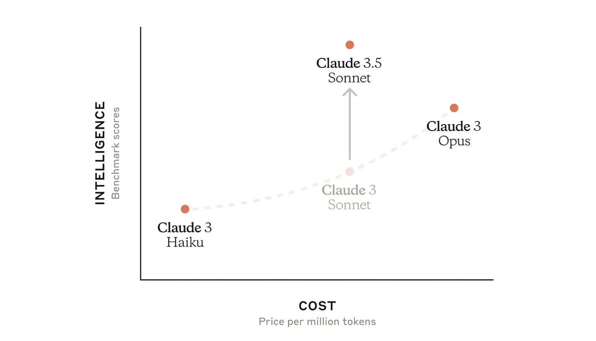
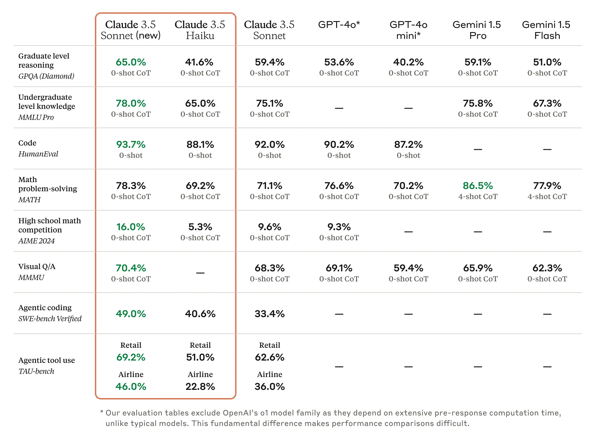
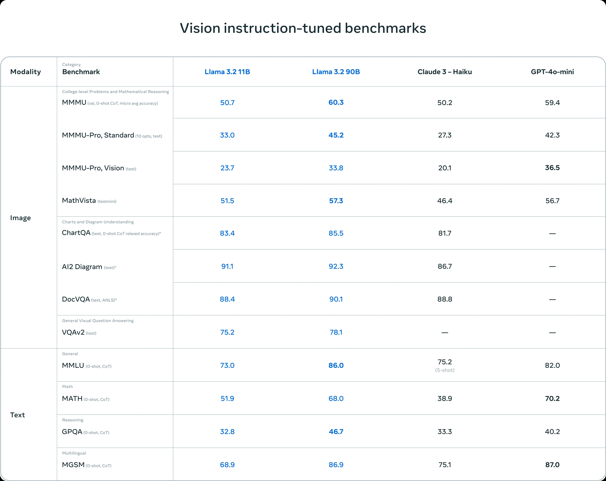
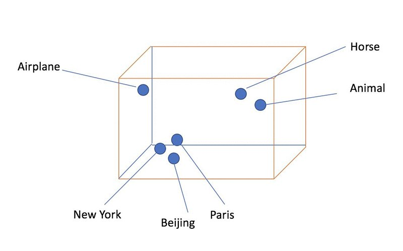
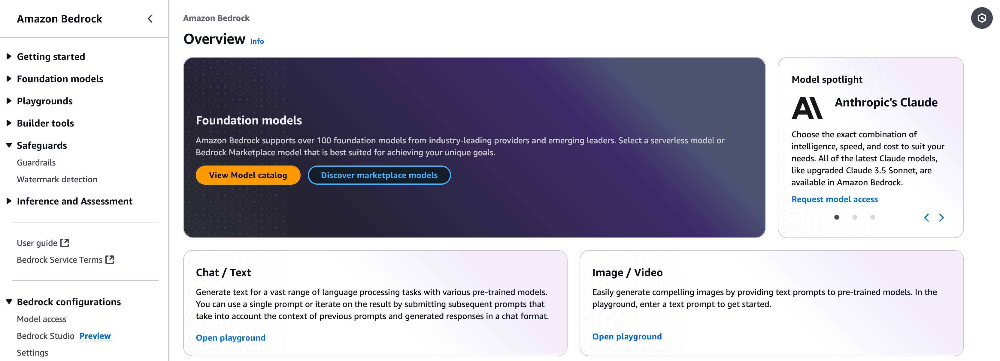
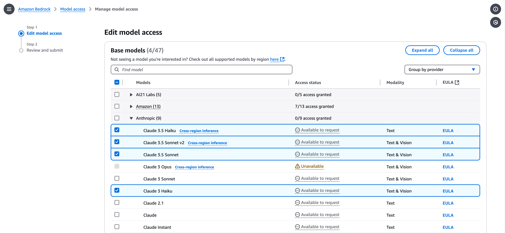
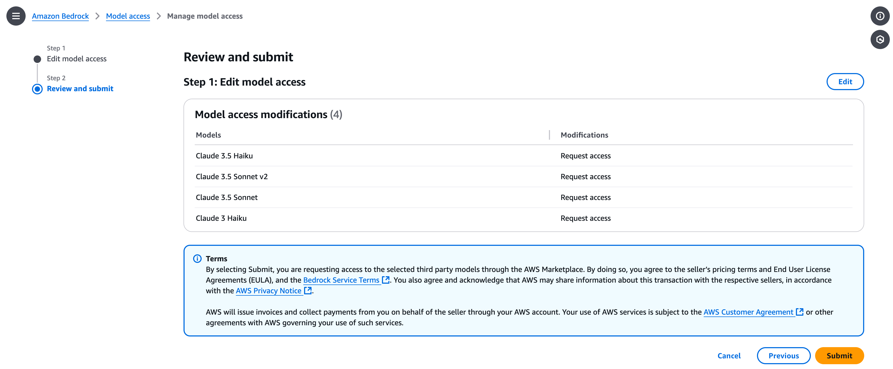
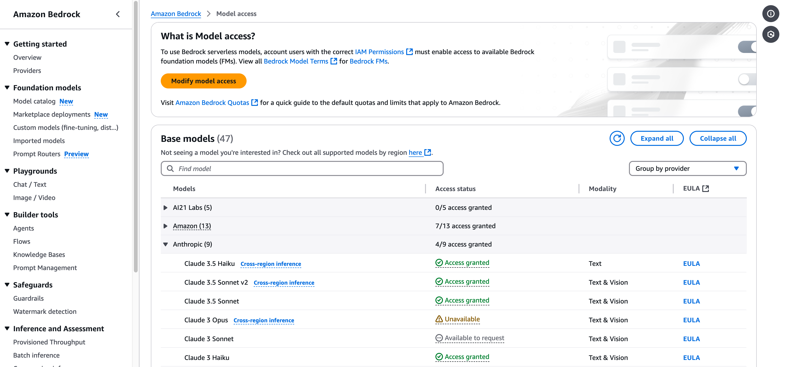
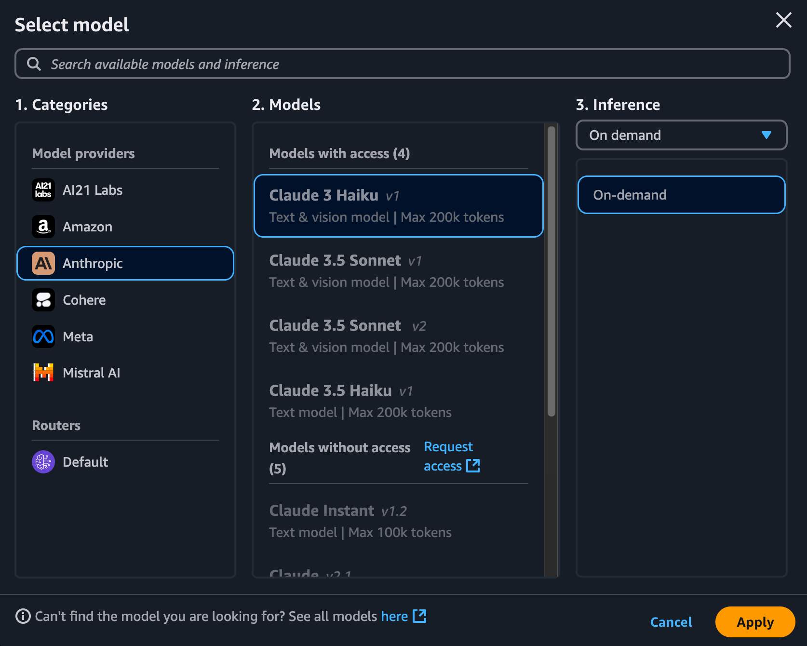
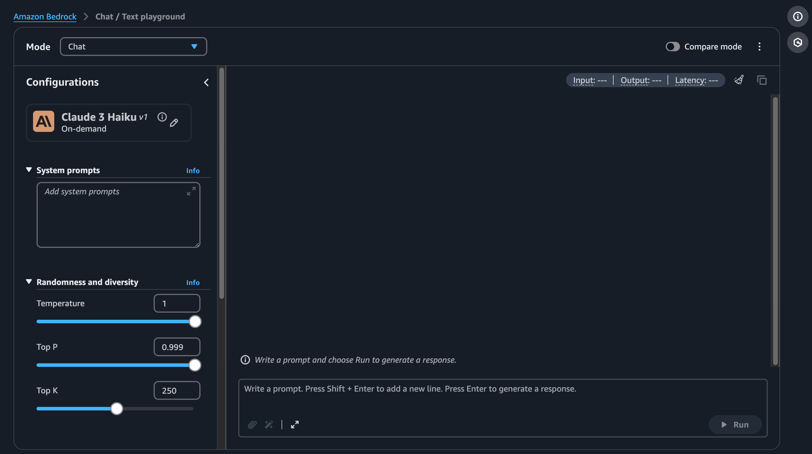

# 02. Amazon Bedrock 시작하기
## 2-1. 주요 Amazon Bedrock 기반 모델
Amazon Bedrock 은 다양한 기반 모델을 제공하여 사용자가 자신의 요구에 맞는 AI 애플리케이션을 쉽게 구축할 수 있도록 지원합니다. 이 섹션에서는 Amazon Bedrock 에서 제공하는 주요 모델들을 텍스트 생성, 이미지 생성, 임베딩 모델로 나우어 살펴보겠습니다.

### 텍스트 생성 모델
1. Amazon Titan Text 모델
Amazon Titan 모델은 Amazon 에서 자체 개발하여 Bedrock에서만 독점적으로 제공하는 모델입니다. 그 중 Amazon Titan Text 는 텍스트 생성 작업에 최적화된 모델로 문서 요약, 분류, 서술형 질문 답변, 창의적인 글쓰기, 정보 추출 등 다양한 용도로 활용할 수 있습니다. 도한 테이블, JSON, CSV 와 같은 구조화된 텍스트 형식과 프로그래밍 언어에 대해서도 사전 훈련되어 있어 폭넓은 응용이 가능합니다.

2. Anthropic Claud 모델
Claud 는 Anthropic 에서 개발한 대형 언어 모델 제품군으로 신뢰성, 윤리성, 안정성을 갖춘 AI 를 목표로 합니다. 간단한 텍스트 기반 작업뿐만 아니라 복잡한 대화와 분석 작업에서도 뛰어난 성능을 보입니다.

Claud 3 시리즈(Heiku, Sonnet, Opus) 는 텍스트와 이미지 입력을 모두 처리할 수 있는 최첨단 멀티모달 모델입니다. 이들은 강력한 비전 기능을 통해 컨ㅁ퓨터 비전과 이미지 이해 애플리케이션에 새로운 가능성을 제시합니다. 이러한 다양한 옵션을 통해 사용자는 자신의 요구 사항과 리소스에 가장 적합한 모델을 선택할 수 있습니다.



[출처](https://www.anthropic.com/news/claude-3-family)

1. Opus : 가장 강력한 모델로, 광범위한 작업에서 탁월한 지능, 추론 능력, 창의성을 제공합니다.
2. Haiku : 매우 높은 속도와 낮은 비용으로 효율적인 성능을 제공합니다.
3. Sonnet : Opus 와 Haiku 사이에서 성능과 효율성의 균형을 제공합니다.

202년 6월 출시된 Claude 3.5 Sonnet 은 Claude 3 Opus 보다도 전문 지식, 코딩, 복잡한 추론을 포함한 분야에서 성능이 뛰어나며 Opus 의 1/5 의 가격으로 더 나은 성능과 속도를 제공하고 있습니다.



그림 2-2 Claude 3.5 벤치마크

2024년 10월 Claude 3.5 Sonnet 이 업그레이드되어 성능이 크게 향상되었습니다. 또한 같은 시기에 Claude 3.5 Haiku 가 출시되어 더욱 빠른 속도와 낮은 비용으로 효울적인 성능을 제공하게 되었습니다. 이러한 업데이트와 신규 모델 출시로 Claude 3.5 시리즈는 더욱 다양한 사용 사례와 요구사항을 충족시킬수 있게 되었습니다.

3. Meta Llama 모델
Meta 에서 개발한 Llama 모델은 모두 오픈소스로 공개되어 있으며 언어적 뉘앙스, 문맥적 이해, 번역 및 대화 생성과 같은 복잡한 자연어 처리 작업에 활용할 수 있습니다. Llama 3.1 모델 패밀리는 8B,  70B, 405B 매개변수 크기의 모델을 제공하여 다양한 사용 사례와 리소스 요구 사항을 충족합니다.

> 1. Llama 3.1 405B : 세계 최대 규모의 공개적을 ㅗ사용 가능한 LLM 으로 엔터프라이즈급 애플리케이션 및 R&D 에 적합합니다. 일반 지식, 장문 텍스트 생성, 다국어 번역, 코딩, 수학, 도구 사용, 고급 추론 및 의사 결정에 탁월한 성능을 보입니다.
> 2. Llama 3.1 70B : 콘텐층 생성, 대화형 AI, 언어 이해, R&D 및 엔터프라이즈 애플리케이션에 이상적입니다. 텍스트 요약, 분류, 감정 분석, 뉘앙스 추론, 언어 모델링, 대화 시스템, 코드 생성에 강점이 있습니다.
> 3. LLAMA 3.1 8B : 제한된 컴퓨팅 파워와 리소스 환경에 적합합니다. 텍스트 요약, 분류, 감정 분석, 저지연 추론이 필요한 언어 번역에 효과적입니다.

Meta 는 150개 이상의 벤치마크 데이터 세트에서 Llima 3.1 의 성능을 측정했으며 모든 주요 벤치마킹 범주에서 이전 버전인 Llima 3 보다 우수한 성능을 보여 주고 있습니다.

특히 Llima 모델들의 ㅡ오픈소스 기반의 접근 방식은 개발자들에게 큰 유연성을 제공합니다. 개발자는 자신의 요구 사항과 애플리케이션 환경에 맞게 모델을 사용자 정의하고 새로운 데이터 세트로 학습하여 미세조정을 수행할 수 있습니다.



그림 2-3 Llima 3.1 벤치마크

출처 : https://ai.meta.com/blog/llima-3-2-connect-2024-vision-edge-mobile-devices

2024년 9월에는 Llima 3.2 모델이 Bedrock 에 출시되었습니다. 엣지 애플리케이션 및 저지연 추론을 위한 경량 모델인 3B, 1B 모델을 제공할 뿐만 아니라 이미지 인식을 위한 90B, 11B 크기의 버전 모델을 사용할 수 있습니다.

### 이미지 생성 모델
1. Amazon Titan Image Generator
'Amazon Titan Image Generator' 는 사용자가 텍스트 입력만으로 손쉽게 고품질 이미지를 생성하고 편집할 수 있도록 지원하는 Amazon 의 최신 텍스트-이미지 변한 모델입니다. 주요 특징은 다음과 같습니다.

> 1. 이미지 생성 : 자연어 프롬ㅍ트를 사용하여 고품질의 사질적인 이미지를 생성합니다.
> 2. 이미지 편집 : 내장된 세스먼테이션 모델을 활용해 기존 이미지를 자동으로 편집합니다. 인페인팅(Inpainting, 이미지의 일부분을 지우고 삭제된 영역을 자연스럽게 채우는 기법)과 아웃페인팅(Outpainting, 이미지의 테두리를 확장하여 새로운 부분을 채우는 기법) 기능을 지원하여 이미지의 특정 부분을 수정하거나 배경을 변경할 수 있습니다.
> 3. 사용자 지정 : 기업의 브랜드 가이드라인에 맞는 이미지 생성을 위해 자체 데이터로 모델을 커스터마이징할 수 있습니다.
> 4. 안전 기능 : 유해 콘텐츠 생성을 방지하고 모든 생성 이미지에 보이지 않는 워터마크(Watermark) 를 포함하여 AI 생성 여부를 식별할 수 있게 합니다.
> 5. 이미지 조작 : 크기 조정 및 이미지 확장, 변형 등 다양한 이미지 조작 기능을 제공합니다.

Amazon Titan Image Generator 는 고품질의 다양한 데이터로 학습되어 폭넓은 주제와 스타일을 다루는 이미지를 생성할 수 있습니다. 이 모델의 ㅡ큰 장점은 생성된 이미지에서 비현실적이거나 부자연스러운 요소들이 적다는 점입니다. 즉, 이미지의 왜곡이 최소화되어 전체적인 구도나 주요 요소들의 비용이 더억 자연스럽고 현실에 가깝게 표현됩니다.

이를 통해 콘텐츠 제작자드은 아이디어를 빠르게 시각화하고 이미지 생성 과정의 효율성을 높일수 있습니다. 또한 대량의 이미지를 저렴한 비용으로 생성할 수 있어 기업의 콘텐츠 제작 비용 절감에도 기여합니다. 이 모델은 광고, 전자상거래, 미디어, 마케팅 등 다양한 분야에서 광고 캠페인, 제품 이미지 편집, 브랜드 이미지 생성 등 폭넓은 용도로 활용될 수 있습니다.

2024년 8월 8일에는 고도화된 이미지 편짐을 이한 Amazon Titan Imagge Generator v2 모델이 출시되었습니다. 기존 Amazon Titan Image Generator v1 의 기능에 더하여 다음과 같은 4가지 기능을 추가적으로 사용할 수 있습니다. 

> 1. 이미지 컨디셔닝(Image Conditioning) : 제공된 참조 이미지 내의 책체, 구조, 영역을 참고하여 정밀한 이미지를 생성
> 2. 생상 컨디셔닝 : 제공된 16진수 색상코드 범주 내에서 이미지를 생성
> 3. 배경 제거 : 전경의 객체와 인물 등을 남기고 배경을 깔끔하게 삭제
> 4. 미세조정을 통한 피사체 일관성 학습 : 특정 브랜드 제품과 캐릭터 등이 이미지에서 유지되도록 모델을 미세조정


그림 2-4 Amazon Titan Image Generator 로 생성한 녹색 이구아나 이미지

2. Stability AI
Stability Deffusion XL(SDXL) 은 Stability AI 가 개발한 텍스트-이미지 변환 모델로 이미지 생성 기술의 ㅡ새로운 지평을 열었습니다. 이 모델은 3.5B 파라미터의 기본 모델과 6.6B 파라미터의 앙상블 파이프라인을 결합한 전문가 혼합(MoEs, Mixture-of-Experts) 시스템을 사용하여 강력한 성능을 제공합니다. SDXL  dms 1024X1024 고해상도 이미지를 생성하며 특히 생생한 색상, 향상된 대비, 조명, 그림자 표현이 두드러집니다.

SDXL 의 주요 특징중 하나는 다양한 아트 스타일을 구현할 수 있다는 점입니다. 포토리얼리즘(Photorealism, 1960년대 후반에 미국에서 나타나는 새로운 예술 사조으 ㅣ하나로 사진과 같은 철저한 사실 표사가 특징이며 하이퍼리얼리즘이라고도 합니다.) 에서 특히 강점을 보이고 모델 자체의 특정한 '느낌에 구애받지 않고 사용자가 원하는 스타일을 자유롭게 표현할 수 있습니다. 또한 손, 텍스트, 복잡한 공간적 구성 등 기존 모델의 한계를 넘어 폭넓은 창작물 제작이 가능해졌습니다.

출처 : https://aws.amazon.com/ko/blogs/korea/amazon-titan-image-generator-and-watermark-detection-api-are-now-availability-in-amazon-bedrock

이 모델은 과ㅏㅇ고, 엔터테인먼트, 디자인 등 다양한 산업 분야에서 창의적인 작업을 위한 도구로 활용할 수 있습니다. Bedrock 을 통해 SXL 1.0 버전이 제공되고 있어 기업들이 고품질의 이미지 생성 기능을 쉽게 자사의 애플리케이션에 통합할 수 있게 되었습니다.

2024년 9월 4일에ㅔ Stability AI 의 최신 텍스트-이미지 변환 모델 3개가 Bedrock 에 출시되었습니다. 다금의 모델은 아래로 갈수록 비용 대비 효율적이고 빠르게 이미지리르 생성하며 위로 갈수록 전문가 수준의 이미지를 생성하는 모델입니다.

> 1. Stability Image Ultra(Ultra) : 최고 품질의 사살적인 출력물을 생성하기 위한 모델로 인쇄 미디어 및 대형 포맷에 적합
> 2. Stability Deffusion 3 Large(SD3 Large) : 웹사이트, 아케팅 자로와 같은 대량의 고품질 디지털 자산등 만들기에 적합
> 3. Stability Image Core(Core) : 빠르고 경제적으로 이미지를 생성하기 위한 모델로, 초기 아이디어 구상을 위해 빠르게 많은 작업을 반복할 적합

이미지 생성에 대해 Ultra 는 Core 모델의 3배에 가까운 비용이며 SD3 Large 는 Core 의 2배를 조금 상회합니다. 비용이 높아질수록 품질이 올라가는 대신, 이미지 생성 시간이 길어지기 때문에 콘셉트 및 디자인 기획, 다지인 시안에 대한 수정 및 검수, 그리고 최종 제작에 이르기까지 진행도에 따라 적절한 이미지 생성 모델을 선택하는 것이 중요합니다. 


그림 2-5 Stable Image Ultra 를 통해 생성한 스팀펑크 스타일의 열쇠

스팀펑크 스타일 : 고전적 디자인의 가방에 현대식 장식품을 다는 것처럼 서로 다른 시대의 패션을 섞어 재창조한 스타일을 가리킨다. 증기기관을 뜻하는 스팀(Steam) 과 사이버펑크(CyberPunk) 를 합성한 데서 비롯됐다.

출처 : https://aws.amazon.com/ko/blogs/korea/amazon-titan-image-generator-and-watermark-detection-api-are-now-availablitity-in-amazon-bedrock

### 임베딩 모델(Embedding model)
임베딩 모델은 구조화되지 않은 방대한 양의 데이터를 효과적으로 분석하고 활용할 수 있게 해주는 기술입니다. 기존의 키워드 매칭 방식과 달리 임베딩은 문서의 전체 맥락과 의미를 포착하여 텍스트나 이미지 등의 데이터를 고차원의 숫자 벡터로 변환합니다. 이를 통해 유사한 의미를 가진 문서들이 벡터 공간에서 가까이 이치하게 되어 보다 정확하고 효율적인 정보 처리가 가능해집니다. 이러한 특성을 인해 데이터 간의 ㅡ의미적 유사성을 계산하거나 다양한 머신러닝 작업에 활용할 수 있습니다.

다음 그림 2-6 은 임베딩 모델의 ㅡ작동 원리를 시작적으로 보여 주고 있습니다. 왼쪽 부분에서는 입력 텍스트가 임베딩 모델을 통과하여 숫자 벡터로 변환되는 과정을 나타냅니다. 각 입력 텍스트는 고유한 벡터 임베딩으로 펴현되며 여러 개의 소수점 숫자로 구성됩니다.

 

출력 : https://aws.amazon.com/ko/blogs/machine-learning/getting-started-with-amazon-titan-text-embeddings

출력 : https://aws.amazon.com/ko/blogs/database/building-ai-powered-search-in-postgresql-using-amazon-sagemaker-and-pgvector

오른쪽 부분의 그래프는 이러한 벡터 임베딩의 배치를 시각화한 것입니ㅏㄷ. 실제 임베딩은 수백 또는 수천 차원의 고차원 벡테이지만, 쉬운 이해를 위해 3차원으로 단순화하여 표현되어 잇습니다. 이 그래프에서 "New York"과 "Paris" 는 도시라는 공통점이 있어 상대적으로 가까이 위치하고 "Horse" 와 "Animal" 은 의미적 연관성으로 서로 근접해 있습니다. 반면 "Airplane" 은 다른 단어들과 의미적 차이가 잇기 때문에 이들과 떨어져 잇는 것을 알수 있습니다.

임베딩 모델은 검색 증강 생성(RAG) 의 구현을 위한 필수 요소로 사용됩니다. RAG 에 대해서는 '04. Bedrock 으로 RAG 구현하기' 에서 자세히 설명할 예정입니다. Bedrock 은 임베딩을 위해 'Cohere Embed' 와 'Amazon Titan Embeddings' 라는 제품군을 제공하고 있습니다.

1. Cohere Embed
Cohere Embed 는 텍스트 문서에서 고품질 임베딩을 생성하도록 훈련된 모델 세트입니다. 이 모델 패밀리는 영어 전용인 Embed English 와 한국어를 포함해 100개 이상의 언어를 지원하는 Embed Multilingual 로 구성되어 있으며 다음과 같은 주요 특징이 있습니다.

> 1. 문서 품질 평가 : 단순한 유사성 측정을 넘어 문서의 품질까지 평가합니다.
> 2. RAG 최적화 : 검색 증강 생성(RAG) 애플리케이션을 위한 검색에 특화되어 있습니다.
> 3. 효율적인 데이터 압출 : 특수 훈련 방법ㅇ을 통해 벡터 데이터베이스 비용을 크게 절감합니다.

Cohere Embed 모델을 다양한 산업 문야에서 활용 될 수 있습니다. 금융 서비스 업계에서는 수익 보고서 분석, 재무 제표 정보 검색, 뉴스 기사 감성 분석 등에 사용될 수 있습니다. 또한 의미 검색, 대규모 검색 엔진 구축, 텍스트 분류, 주제 모델링, 추천 시스템 등 광범위한 애플리케이션에도 적용 가능합니다.

이 모델은 고성능 기능을 제공하면서도 압축된 임베딩 출력을 통해 지연 시간을 개선하고 스토리지 비용을 절감할 수 있습니다. 이를 통해 기업들은 더욱 효율적인 정보 관리와 분석을 수행할 수 있게 됩니다.

2. Amazon Titan Embeddings
Amazon titan Embeddings 는 다양한 데이터 유형을 효과적으로 처리하고 분석할 수 있는 강력한 임베딩 모델 제품군입니다. 이 제품군은 Titan Text Embeddings V2, Titan Text Embeddings 그리고 Titan Multimodal Embeddins 로 구성되어 있으며 각각 다음과 같은 특징이 있습니다.

> 1. Titan Text Embeddins V2 : RAG 에 최적화된 최신 모델로 100개 이상의 언어와 코드 임베딩을 지원하고 256/512/1024 차원 중 선택 가능한 벡터를 생성합니다. 개인화된 검색 및 추천 시스템에 특히 유용합니다.
> 2. Titan Text Embeddings : 최대 8,000 토큰의 텍스트를 처리하고 25개 이상의 언어를 지원하며 1,536 차원 벡터를 출력합니다. 다국어 문서 분류 및 의미 검색에 적합합니다.
> 3. Titan Multimodal Embeddings : 텍스트와 이미지를 동시에 처리하며 최대 128 토큰의 영어 텍스트와 이미지를 1,024 차원(조정가능) 벡터로 변환합니다. 이미지 검색 및 추천에 활용됩니다.

이 제품군은 멀티모달 거색, 의미 검색, 문서 클러스터링, 콘텐츠 분류 등 다양한 애플리케이션에 활용 될 수 있습니다.

## 2-2. Bedrock 사용하기
이제부터는 본격적으로 Amazon Bedrock 을 사용하는 방법에 대해 알아보겠습니다. AWS 관리 콘솔 환경에서 바로 사용 가능한 AWS 의 다른 서비스들과는 달리 AWS에서 다양한 모델들을 사용하기 위해서는 모델 액세스 구성이 필수적입니다.

### Model Access Setup
모델 액세스 구성은 Amazon Bedrock 에서 제공하는 다양한 모델들 중 원하는 모델을 선택하고 활성화하는 과정입니다. 이를 통해 선택한 모델들을 콘솔 또는 API 형태로 사용 할 수 있게 됩니다. 모델 액세스 구성 방법은 다음과 같습니다.

01. AWS 관리 콘솔(AWS Management Console) 에서 '미국 동부(버지니아 북부, us-east-1) 리전'을 선택하고 Amazon Bedrock 콘솔로 이동합니다. 버지니아 북부 리전에서 최신의 모델들을 사용해 볼수 있으니 해당 리전에서 모든 실습을 진행하도록 하겠습니다.

02. 왼쪽 하단 메뉴에서 [모델 액세스] 버튼을 클릭하고 변경된 화면에서 [특정 모델 활성화] 버튼을 클릭합니다. 모델 액세스 구성 화면에서는 현재 리전에서 사용 가능한 모델 목록과 액세스 상태를 확인할 수 있습니다. 최신의 모델들을 사용해 볼 수 있으니 해당 리전에서 모든 실습을 진행하도록 하겠습니다.



03. [모델 액세스 권한 요청] 의 단계 1에 진입했습니다. Anthropic 의 Sonnet 모델과 Haiku 모델의 체크 박스를 선택하여 액세스 권한을 요청합니다. 이후 필요한 다른 모델들에 대해서도 동일한 과정으로 모델 액세스 권한을 요청할 수 있습니다.



그림 2-8 Bedrock 에서 모델 액세스 설정

04. 단계 2에서는 권한을 요청하기 위한 사용 사례를 간단하게 작성하여 제출합니다.



05. 단계 3에서 검토를 마치고 최종 제출을 안료하면, 수분 내로 모델 액세스 요청이 반영된 화면을 확인할 수 있습니다. 이제부터 Amazon Bedrock 을 사용할 수 있게 됩니다.



## TIP
### AWS Marketplace 에서 지원하는 언어 모델
Amazon Bedrock 에서 사용 가능한 모델들중 공급자가 Amazon 이 아닌 Anthropic, Cohere 등의 회사에서 개발한 모델은 AWS Marketplace 를 통해 Bedrock 에 통합됩니다. AWS Marketplace 는 AWS 외의 회사들이 자신의 소프트웨어를 판매할 수 있는 플랫폼입니다. AWS 관리 콘솔에서 Marketplace 에 접속하면 구독 중인 모델 리스트를 확인 할 수 있습니다.

AWS Marketplace 를 통해 모델을 공급하고 있으므로 모델별 권한 제어가 필요한 경우 다음의 코드 2-1 과 같이 IAM 정책을 적용할 수 있습니다.

## AWS Management Console 에서 Bedrock 사용하기(Playgrounds)
AWS 환경에서 Bedrock 을 가장 빠르고 쉽게 사용하는 방법은 AWS 관리 콘솔에 로그인하여 직접 사용하는 것입니다. 코드를 작성하거나 터미널에서 명령어를 실행하지 않고도, Amazon Bedrock 내 모델을 테스트할 수 있습니다. 이를 위해 플레이그라운드를 사용하면 됩니다. 플레이그라운드 Amazon Bedrock 왼쪽 메뉴에서 Chat, Text 및 Image 형태로 사용해 볼 수 있습니다.

1. 플레이그라운드
플레이그라운드에서 Chat/Text 를 선택한 후, [모델 선택]창에서 Amazon Bedrock 엣 ㅓ접근 권한이 부여된 모델들 중 원하는 것을 고르면 해당 모델을 사용할 수 있습니다.



그림 2-12 플레이그라운드 - 모델 선택



➊ [Mode](드롭다운) 메뉴 : [Chat][채팅 형식]과 [single prompt][텍스트 형식]중 원하는 호출 방법을 선택할 수 있습니다.
➋ [Compare Mode][토글 스위치] : 다른 모델과 출력 결과를 비교하고자 할 때 사용합니다.
➌ [예시 로드하기] 버튼 : 모델별, 사용 시 사례별 프롬프트 예시를 불러올 수 있는 기능을 제공합니다.
➍ [더보기 메뉴] : 스트리밍 설정, 대화 내역 JSON 다운로드, 단축키 보기 등의 옵션을 제공합니다.
➎ [조정 아이콘] : 모델 API 호출 시 변경 가능한 파라미터 값들을 조정할 수 있습니다.
➏ [Input, Output, Latency 표시] : 모델 응답 후 각각 입력 토큰, 출력 토큰, 지연 시간 정보를 제공합니다.
➐ [새로 고침 아이콘] : 대화 내용을 초기화하는 기능을 제공합니다.
➑ [복사 아이콘] : 대화 내용을 복사하는 기능을 제공합니다. 

다음의 그림 2-14 는 Bedrock 의 요금체계를 설명하는 문서를 업로드하고 내용을 파악하는 예시입니다. [실행] 버튼을 클릭하면 선택한 모델로부터 응답을 받을 수 있습니다. 입력창 하단의 [Choose files] 버튼을 사용하여 문서, 사진 등을 업로드하고 언어 모델과 대화를 이어갈 수 있습니다. 모델마다 지원하는 파일 형식(csv, doc, pdf 등)이 다름니다. 특정 모델이 지원하는 파일 형식은 모델을 선택한 후 그램 2-14 하단의 [Choose files] 버튼 아래에 표시되는 문구에서 확인 할 수 있습니다.

Claude 3.5 Sonnet V1
* 어떤 내용이 담겨있나요?
    * 파일 업로드 : `bedrock-studio-user-guide.pdf`

표시된 문구는 "The supported file types are .csv, .doc, .docx, .html, .md, .pdf, .txt, .xls, .gif, .jpeg, .webp, Maximums 5 files, 4.5MB each." 로, 확장자가 '지원되는 파일 형식은 확장자가 .csv, .doc, .docx, .html, .md, .pdf, .txt, .xls, .gif, .jpeg, .webp' 인 파일로 개별 용량이 4.5MB 이하로 최대 5개까지 지원한다는 내용입니다.

2. 토큰(Token)
언어 모델에서 토큰은 텍스트를 처리하는 기본 단위로 토큰화하는 텍스트를 이러한 작은 단위로 나누는 과정을 말합니다. 토큰은 단어, 부분 단어, 문자, 또는 부호 등 의미 있는 텍스트 단위가 될 수 있습니다. 토큰은 언어와 모델에 따라 다르게 정의될 수 있으며, 일반적으로 자주 사용되는 단어나 부분은 단일 토큰으로 표현되고 희귀한 단어는 여러 토큰으로 분할될 수 있습니다. 토큰화는 모델의 성능과 효율성에 직접적인 영향을 미치며, 입력 텍스트의 길이 제한과도 관련이 있습니다. 예를 들어 "안녕하세요" 는 ["안녕", "하세요"] 또는 ["안녕", "하", "세요"]와 같이 토큰화될 수 있습니다.

Bedrock 은 모델별로 다르게 정의된 토큰을 기반을 기반으로 입력 및 출력 토큰에 대해 각각 다른 과금 체계를 적용합니다. 일반적으로 예상 토큰 수는 모델 공급사가 토큰 계산 API 를 제공하지 않는 한 사전에 알기 어려우며, 모델 호출 후에야 추적이 가능합니다. 다만 최근 Anthropic 이 토큰 계산 API 를 제공하기 시작하면서 해당 모델에 한해 예상 토큰 수를 미리 확인할 수 있게 되었습니다.

## TIP
### Chat 과 Text 는 어떻게 다른가요?
플레이그라운드에서 모델을 선택할 때 Chat과 Text 모두 동일한 모델명이 표시되지만 플레이그라운드는 분리되서 있습니다. 플레이그라운드를 설명하는 AWS 공식 문서에 따르면 Chat 은 채팅 모델을 실험할 수 있고 Text 는 텍스트 모델을 실험할 수 있다고 명시되어 있습니다.

Chat | Text
---- | ----
대화형 인터페이스를 제공하여 질문을 하고 응답을 받을 수 있습니다. | 텍스트 입력 창에 프롬프트(Prompt)를 입력하고 모델의 출력을 확인할 수 있습니다.
이전 대화 내용을 기반으로 컨텍스트를 유지하며 대화를 이어갈 수 있습니다. | 대화 형식이 아닌 일회성 텍스트 입력과 출력으로 구성됩니다.
실제 채팅 환경과 유사한 인터페이스를 제공합니다. | 이전 입력 내용과의 컨텍스트는 유지되지 않습니다.

즉 Chat 플레이그라운드는 실제 대화 환경을 모방하여 컨텍스트를 유지하여 상호작용할 수 있는 반면 Text 플레이그라운드는 일회성 텍스트 입력과 출력을 통해 다양한 프롬프트를 실험해 볼 수 있는 환경입니다. AWS 관리 콘솔에서 보이는 화면의 차이점 외에도 프로그래밍 방식으로 모델을 호출할 떄도 두 유형은 각기 다른 방식으로 모델을 호출합니다. 해당 매용은 뒤에 이어지는 'Bedrock API 이해하기' 유닛에서 자세히 설명하겠습니다.

3. 구성(Configuration)
이어서 [플레이그라운드] 왼쪽 상단의 [조정] 아이콘을 클릭해 구성(그림 2-13 참고) 부분에 대해 알아보겠습니다. 변경 가능한 구성은 모델마다 다르지만 일반적으로 시스템 프롬프트와 무작위성과 다양성(Randomness and diversity) 으로 구성되어 있습니다. 시스템 프롬프트는 Model API 에서 시스템 변수를 지원하는 모델에 한해서만 활성화되어 있으며 무작위성과 다양성은 추론 매개변수라고 불립니다.

> ➊ 시스템 프롬포트 : 이 필드를 통해 특정 목표나 역활과 같은 지침을 제공할 수 있습니다.
> ➋ 무작위성과 다양성(Randomness and diversity)
    - 온도 : 온도 값이 낮으면 높은 확률의 출력을 선택하고 높으면 낮은 확률의 출력을 선택합니다. 즉 온도값이 낮을 수록 결정론적인 응답이 온도가 높을 수록 무작위적인 응답이 출력됩니다.
    - 상위 K : 모델이 다른 토큰 선택시 고려하는 가장 가능성 높은 후보의 수를 가리킵니다. 예를 들어 상위 K 값이 10이라면 다음 답변을 출력 시 가능성이 가장 높은 10개의 토큰 중에서 선택합니다.
    - 상위 P : 모델이 다른 토큰 선택시 고려하는 가장 가능성 높은 후보의 백분율입니다. 예를 들어 상위 P 값이 0.5 라면 다음 답변 출력시 다음 토큰이 될 수 있는 확률 분포의 상위 50% 에서 선택합니다.
> ➌ 길이
    - 최대 길이 : 응답의 최대 길이를 제한하는 매개변수입니다.
    - 정지 시퀀스( Stop Sequence) : 추가 토큰 생성을 중지하도록 하는 문자를 지정합니다. 모델이 정지 시퀀스를 생성하면 시퀀스 이후 생성을 중지합니다.

### Amazon Bedrock 용 MacOS 클라이언트
Open AI, Anthropic, 등 주요 LLM 공급업체들은 웹과 API 형태로 서비스를 제공하지만, 데스크톱 및 모바일 애플리케이션을 통해 사용자 경험을 향상시키기도 합니다. 아마존 역시 Bedrock 에서 제공하는 모델들을 MacOS 전용 오픈 소스 클라이언트로 제공하고 있습니다. (윈도우용 애플리케이션은 2024년 12월 현재 지원되지  않습니다.) 웹브라우저를 통해 다음 링크의 'AWS Samples' 깃허브(https://github.com/aws-samples/amazon-bedrock-client-for-mac) 로 접속하면 GitHub 저장소 페이지가 열럽니다.

해당 페이지에서 스크롤을 내리면 있는 하단의 [DOWNLOAD] 버튼을 클릭해 다운로드할 수 있습니다. 이 애플리케이션은 MacOS 13 이상 버전에서 실행 가능하며 Bedrock 에 접근할 수 있는 AWS 계정이 필요합니다.

설치가 완료되면 애플리케이션 화면이 열리고 AWS 관리 콘솔에 접속하지 않고도 Bedrock 의 모델을 채팅 형식으로 사용할 수 있습니다. 상단에서 모델을 선택하고 스트리밍 지원 등 기본 설정을 제공합니다. 채팅 방식이므로 질문 유형이 다르다면 [New Chat] 버튼을 클릭하여 새로운 대화를 시작하는 것이 좋습니다.

그림 2-17 과 같이 왼쪽 패널에서 과거 대화를 선택하여 삭제하거나 텍스트 파일로 내보내기도 가능합니다.

### 프로그래밍 방식을 Bedrock 사용하기
AWS 서비스를 프로그래밍 방식으로 사용하려면 해당 서비스의 엔드 포인트(Endpoing) 를 호출해야 합니다. AWS 에서는 다양한 프로그래밍 언어를 지원하는 SDK 를 제공하여 서비스 엔드 포인트 호출을 용이하게 해줍니다. 여기서는 Python 용 AWS SDK 인 boto3 를 사용하여 Amazon Bedrock API 를 호출하는 방법을 살펴보겠습니다.

다음의 코드 2-2는 Claude 3 Haiku 모델을 이용하여 주어진 프롬프트에 대한 응답을 생성하는 예시입니다. Bedrock API 는 JSON 형식으로 요청과 응답을 주고받기 때문에 이에 맞춰 구현되어 있습니다. boto3 를 활용하여 Bedrock 클라이언트를 생성하고 'Invoke_model' 메서드를 호출하여 Bedrock 에서 호스팅 중인 모델에 추론 요청을 보냅니다. 그 후 받은 API 응답을 가공하여 애플리케이션에 적합한 형태로 변환하는 간단한 코드입니다.

```
import boto3
import json

# Bedrock 클라이언트 생성
client = boto3.client("bedrock-runtime", region_name="us-west-2")

# 모델 ID 및 프롬프트 설정
model_id = "anthropic.claude-3-haiku-20240307-v1:0"
prompt = "이 책을 읽고 있는 독자에게, 응원의 말을 한문장으로 적어줘"

# 요청 생성
native_request = {
    "anthropic_version": "bedrock-2023-05-31",
    "max_tokens": 512,
    "temperature": 0.5,
    "messages": [
        {
            "role": "user",
            "content": [{"type": "text", "text": prompt}],
        }
    ],
}

request = json.dumps(native_request)

# Bedrock API 호출
response = client.invoke_model(modelId=model_id, body=request)
model_response = json.loads(response["body"].read())

# 응답 출력
response_text = model_response["content"][0]["text"]
print(response_text)
```

코드 2-2 를 실행하면 다음과 같은 답변을 받을 수 있습니다.
```
'이 책을 읽고 계신 독자 여러분, 당신의 열정과 노력이 언젠가는 반드시 결실을 맞을 것이며 그 과정에서 얻게 되는 성장과 경험이 당신을 더욱 강하고 지혜롭게 만들 것입니다.'
```

지금까지 프로그래밍 을 통해 Bedrock API 를 호출하는 방법에 대해 알아 보았습니다. 호출 외에도 Bedrock API 에는 다양한 종류가 있으며 개발자들은 각 사용 사례에 적합한 API 를 이해하고 활동해야 합니다. 이를 통해 자신의 애플리케이션에 가장 적합한 방식으로 Bedrock 을 통합할 수 있게 될 것입니다.

### LangChain 으로 Bedrock 사용하기
이번 유닛에서는 AWS SDK 를 직접 활용하는 방법 외에도 LLM 기반의 애플리케이션 개발에 널리 사용되는 오픈소스 프레임워크인 LangChain 을 활용하여 Bedrock 을 사용하는 방법을 소개합니다. LangChain 은 Amaonz Bedrock 서비스 뿐만 아니라 다양한 LLM 임베딩 모델, 벡터 스토어(Vector Store) 등을 지원하여 LLM 기반 앱 개발에 유용하게 활용될 수 있습니다. 예를 들어 LLM 모델 호출, 데이터 로딩 및 전처리, 결과 후처리, 메모리 관리 등의 기능을 제공합니다. 또한, 체인(Chain) 개념을 통해 여러 LLM 모델과 다른 구성 요소를 연결하여 복잡한 워크플로우(Workflow) 를 구축할 수 있습니다. 먼저 LangChain 설치를 비롯한 실습 환경을 구성하는 방법을 살펴보겠습니다. 이후 Bedrock 모델을 LangChain 과 연동하는 방법을 예제와 함께 살펴보겠습니다.

### 1. 실습 환경 구성하기
본 실습에서는 VSCode 환경을 권장합니다.

01. 'pipenv' 는 Python 프로젝트를 위한 가상 환경을 생성/관리하며 패키지 설치/제거를 위한 도구입니다. 우선 'pipenv shell' 명령어로 가상 환경을 생성합니다.
02. 'pipenv --venv' 명령어로 생성된 가상 환경 경로를 확인합니다. 이떄 'Bedrock-[Hash]' 가 VSCode 하단에 표시되어 있다면 해당 가상 환경이 활성화된 상태입니다.
```
pipenv --venv

/Users/heuri/.local/share/virtualenvs/bedrock-lMA3NLh0'
```

03. 확인한 가상 환경 경로가 VSCode 하단의 인터프리터로 지정되어 있지 않다면 VSCode 의 커맨드 팔레트(Command Palette) 를 열어 수동으로 지정할 수 있습니다. Ctrl + Shift + P(Windows) / Command + Shift + P(MacOS) 단축키를 사용한 후 'Python: Select Interpreter' 를 검색하여 가상 환경 경로를 입력합니다.
04. Amazon Bedrock 을 호출하는 코드를 작성하기 위해 다음과 같이 필요한 패키지를 설치합니다.
```
pepenv install langchain langchain-community langchain-aws boto3
```

### 2. LangChain 코드 작성
코드를 다음과 같이 작성하고 실행하여 결과를 확인합니다.
```
from langchain_aws import BedrockLLM

# Bedrock 모델 설정
llm = BedrockLLM(model_id="anthropic.claude-v2:1")

# 모델을 호출하여 응답 받기
response = llm.invoke("랭체인으로 LLM 활용하기 참 쉽죠?")

print(response)
```

코드 2-3. LangChain 으로 Claude 2.1 모델 호출

LangChain 을 활용하면 AWS SDK 를 직접 사용하는 방식보다 훨씬 더 쉽고 빠르게 LLM 기반 애플리케이션을 개발할 수 있습니다. 요청과 응답을 처리하기 위해 JSON 관련 코드를 작성할 필요가 줄어 들고, 몇 줄의 코드로 API 와 통합할 수 있습니다. 이렇듯 LangChain 은 LLM 기반 애플리케이션 개발을 크게 단순화하고 가속화할 수 있습니다.

### Bedrock API 이해하기
API 와 상호 작용할 떄는 일반적으로 JSON 형식을 사용하여 요청(Request) 와 응답(Response) 를 주고 받습니다. LLM 을 프로그래밍 방식으로 활용하려면 모델마다 다른 호출 받식을 익혀야 하는 어려움이 있습니다. 심지어 같은 모델이라도 Chat 모드와 Text 모드에 따라 호출 방식이 달라질 수 있어 혼란스러울수 있습니다.(참고. TIP. Chat 과 Text 는 어떻게 다른가요?) 하지만 LLM 호출 API 의 대략적인 구성을 이해하면 어떤 모델이든 쉽게 파악하고 사용할 수 있습니다. 이번에는 Bedrock API 의 구성과 용도 및 모델들의 특징에 따라 다른 API 호출 방법을 갖고 있음을 알아보겠습니다.

AWS 에서 서비스를 프로그래밍 방식으로 사용하려면 '{서비스}.{리전}.amazonaws.com' 형식의 엔드포인트를 사용해야 합니다. 그중 Bedrock 은 크게 네가지의 서비스 엔드포인트로 구성되어 있습니다.

➊ Bedrock : 모델 및 Bedrock 서비스(Evaluation, Guardrail) 등의 서비스를 관리하기 위한 API
➋ Bedrock-runtime : Amazon Bedrock 에서 호스팅되는 모델에 대한 추론 요청을 하기 위한 API
➌ Bedrock-agent : 에이전(Agent) 와 지식 기반(Knowledge Base) 을 생성하고 관리하기 위한 API
➍ Bedrock-agent-runtime : 에이전트 호출 및 지식 기반 쿼리를 수행하기 위한 API

위 4가지 서비스 엔드포인트 중 가장 많이 사용하는 LLM 호출에 관련된 런타임에 대하여 더 자세히 알아 보겠습니다. Bedrock 에서 호스팅되는 모델에 대한 추론 작업은 Amazon Bedrock RUntime 을 통해 수행해야 합니다. 현재 Invoke, Converse 등 5가지 작업을 지원하며 각 작업은 특정 용도에 맞게 설계되어 있습니다.

이중에서 가장 많이 사용되는 LLM 호출과 관련된 Bedrock-runtime 에 대해 더 자세히 알아보겠습니다. Bedrock 에서 호스팅되는 모델에 대한 추론 작업은 Amazon Bedrock Runtime 을 통해 수행입니다. Bedrock 에서 호스팅되는 모델에 대한 추론 작업은 Amazon Bedrock Runtime 을 통해 수행됩니다. 현재 다음과 같은 다섯 가지 주요 작업을 지원하며 각 작업은 특정 용도에 맞게 설계되어 있습니다. 

➊ ApplyGuardrail : AI 정책에 맞게 지정된 보호 장치를 적용하는 작업
➋ InvokeMode : 특정 모델을 지정하고 프롬프트 및 추론 매개변수를 사용해 모델을 호출하는 작업
➌ InvokeModel[WithResponseStream] : InvokeModel 과 동일한 기능이며 스트리밍방식으로 모델 응답을 받는 작업
➍ Converse : 일관된 인터페이스를 통해 대화형 모델과의 상호작용을 위한 작업
➎ ConverseStream : Converse 와 동일한 기능이며 스트리밍 방식으로 모델 응답을 받는 작업

비슷해 보이는 Bedrock Runtime 내 API 를 이해하기 위해 가장 대표적인 InvokeModel API 에 대해 더 자세히 알아보겠습니다. Bedrock 은 AI21 Labs, Anthropic, Cohere, Meta, Mistral AI, Stablility AI 및 Amazon 과 같은 다양한 AI 기업들의 기반 모델을 제공합니다. 각 공급사마다 다른 방식으로 모델 API 호출 방식을 정의하였기 때문에 Bedrock Runtime 내 InvokeModel 사용 방법도 모델별로 차이가 있습니다. 이러한 차이점을 몇가지 예시를 통해 차이를 살펴보겠습니다.

### 1. Amazon Titan Text Models
Amazon Titan 은 2024년 12월 현재 Text 모델만 제공하므로 Chat 모델 API 를 고려할 필요가 없습니다. 완성된 응답을 받을 때는 InvokeModel 을, 실시간 스트리밍 형태로 답병르 받을 떄는 InvokeModelWithResponseStream 을 사용합니다.

### 2. Anthropic Claude models
Claude 모델은 Text 와 Chat 두 가지 모드를 지원합니다. Text 모드에는 'Anthropic Claude Text Completions API' 를 Chat 모드에는 'Anthropic Claude Messages API' 를 사용해야 합니다. 각 모드에 따라 JSON 요청/응답 형식이 다르게 구성되어 있습니다. 완성된 답변을 받을 떄는 InvokeMoel 을 스트리밍 형태로 답변을 받을 떄는 InvokeModelWithResponseStream 을 사용하되 Claude 모델에 맞는 JSON 형식으로 작성해야 합니다.

### 3. Mistral AI Models
Mistral 모델 또한 Text 와 Chat 두 가지 모드를 지원합니다. Text 모드에는 'Mistral AI text completion' API 를 Chat 모드에는 'Mistral AI chat completion' API 를 사용합니다.

지금까지 '서비스 앤드포인트' - 'Bedrock 런타임' - 'Invoke Model' 로 이어지는 Bedrock 의 API 구조에 대해 알아보았습니다. Bedrock 내의 다양한 API 구조를 이해함트로써 AI 모델들이 어떻게 통합되고 관리되는 지 파악할 수 있습니다. 이를 이해하면 향후 새로운 AI 모델이나 기능이 Bedrock 에 추가될 떄 신속하게 이해하고 적용할 수 있습니다. 또한 LangChain 과 같은 외부 라이브러리의 구조를 파악하는 데에도 큰 도움이 됩니다. 예를 들어 LangChain 에서 Bedrock 을 호출할 떄 BedrockLLM ChatBedrock 과 같은 서로  다른 클래스로 구현되어 있는 이유를 명확히 이해할 수 있게 됩니다.

## TIP
### 프롬프트 전달 방식은 모델마다 다른가요?
앞서 설명한 대로 Bedrock 내 모델들은 각각의 특성에 따라 다른 API 호출 방법을사용합니다. 이는 프롬프트 전달 방식에도 적용됩니다.

➊ Titan 모델:
- 프롬프트를 'inputText' 라는 변수에 담아 요청합니다.
- 형식 : '"InputText": "User: <prompt>\nBot"'
- 'User:' 및 'Bot:' 접두사(prefix) 를 인식하도록 특별히 훈련되었습니다.
- 'User:' 는 사용자 프롬프트를 'Bot:' 은 모델의 텍스트 완성 시작을 나타냅니다.

➋ Claude 모델:
- 프롬프트를 'Prompt' 라는 변수에 담아 전달합니다.
- 형식: "\n\nHuman: {userQustion}\n\nAssistant:"

➌ Mistral 모델:
- 사용자의 질문이나 지시사항을 '[INST]' 태그 사이에 넣습니다.
- 형식: '"<s>[INST] {userQuestin} [/INST]"'

각 언어 모델을 효과적으로 활용하기 위해서는 해당 모델의 문서를 꼭 참조하여 최적화된 프롬프트를 작성하는 것이 중요합니다. 모델마다 프롬프트 형식과 특성이 다르므로, 각 모델에 맞는 방식으로 프롬프트를 구성해야 최상의 결과를 얻을 수 있습니다.

## Converse API: Amazon Bedrock 의 통합 인터페이스 API
Amazon Bedrock 은 다양한 모델을 제공하지만 공급사마다 API 호출 방식이 달라 각각을 익히는 것은 번거로운 일입니다. 이러한 불편을 해소하고자 AWS 는 모든 모델에 일관된 인터페이스를 제공하는 Converse API 를 도입했습니다.

Converse API 는 Amazon Bedrock 모델과 연동되는 통일된 환경을 제공하여 개발자가 모델별 구현을 별도로 관리할 필요가 없게 합니다. 이 API 를 사용하면 한 번 작성한 코드로 Amazon Bedrock 의 여러 모델을 원활하게 활용할 수 있습니다. 따라서 기존의 InvokeModel 대신 Converse 를 InvokeModelWithResponseStream 대신 ConverseStream 을 사용하는 것이 권장됩니다.

일관된 인터페이스 제공 외에도 추가적인 이점이 있습니다. 이 API 를 사용하면 애플리케이션에서 Tool use(또는 Function calling) 쉽게 구현할 수 있습니다. 이러한 고급 기능들에 대해서는 '05. Bedrock 으로 Agent 구현하기' 에서 자세히 다루도록 하겠습니다.

앞서 코드 2-2 에서 InvokeModel 형식으로 Haiku API 를 호출해 보았다면 Converse API 를 활용한 이미지 분석 예시를 살펴보겠습니다. Converse API 는 임베딩 모델이나 이미지 생성 모델은 지원하지 않으므로 이 예시에서는 플레이그라운드에서 미리 생성한 샘플 이미지를 사용하여 분석을 진행하겠습니다.

그림 2-18 은 플레이그라운드에서 Titan Image Generator G1 v2 모델을 활용하여 이미지 개수만 1개로 조정한 구성 값으로 "Draw a student studying AI in a cartoon style." 이라는 프롬프트를 적용하여 생성했습니다.

Converse API 는 Amazon Bedrock 모델과 메시지를 주고받는 대화형 API 입니다. 모델에 요청을 보내려면 Message 객체에 역활(user/assistant) 과 text, image, document 등의 형식을 지정하여 모델을 호출합니다. ContentBlock 에는 이미지 분석을 요청하는 지시사항(프롬프트, text 형태)과 함께 이미지 파일의 포맷 및 byte 로 변환된 정보를 포함하여 요청을 보냅니다.
```
import boto3
from botocore.exceptions import ClientError

# 이미지 생성 작업을 위한 베드락 런타임 클라이언트 생성
client = boto3.client("bedrock-runtime", region_name="us-east-1")

model_id = "anthropic.claude-3-haiku-20240307-v1:0"

image_path = "Draw a student studying AI in a cartoon style.png"
with open(image_path, "rb") as image_file:
    image_bytes = image_file.read()

# 이미지와 이미지 분석 요청 텍스트가 포함된 ContentBlock 작성
user_message = "서문 없이 사진을 분석한 결과를 작성해 주세요."
conversation = [
    {
        "role": "user",
        "content": [
            { "text": user_message },
            {
                "image": {
                    "format": "png",
                    "source": {
                        "bytes": image_bytes
                    }
                }
            }
        ]
    }
]

try:
    response = client.converse(
        modelId=model_id,
        messages=conversation,
        inferenceConfig={"maxTokens": 4096, "temperature": 0.5, "topP": 0.9},
    )

    response_text = response["output"]["message"]["content"][0]["text"]
    print(response_text)

except (ClientError, Exception) as e:
    print(f"ERROR: Can't invoke '{model_id}'. Reason: {e}")
    exit(1)
```

코드 2-4 Converse API 로 이미지 분석

코드 2-4 를 실행하면 다음과 같은 이미지 분석 결과를 맏을 수 있습니다.
```
이 이미지는 인공지능(AI)에 대한 주제를 다루고 있습니다. 이미지 중앙에는 AI 라는 단어가 큰 글씨로 표시되어 있으며 주변에는 기여, 전구, 책 등 다양한 아이콘이 배치되어 있습니다. 이미지의 오른쪽에는 책을 돌고 있는 만화 캐릭터가 그려져 있는 데 이는 AI 기술을 배우고 연구하는 학생을 나타내고 있습니다. 전반적으로 이미지는 AI 기술에 대한 관심과 학습을 강조하고 있습니다.
```

지금까지 Amazon Bedrock 의 다양한 모델들과 이를 활용하는 방법에 대해 살펴보았습니다. AWS 관리 콘솔을 통한 접근부터 프로그래밍 방식의 API 호출까지 여러 접근 방식을 학습했습니다.

이러한 강력한 도구들을 효과적으로 활용하기 위해서는 AI 모델에 적절한 지시를 내리는 것이 종요합니다. 다음 '03. 프롬프트 엔지니어링(Prompt Engineering)' 에서는 모델의 잠재력을 최대한 끌어내고 원하는 결과를 얻기 위한 핵심 기술인 프롬프트 엔지니어링에 대해 자헤시 알아 보겠습니다.
 