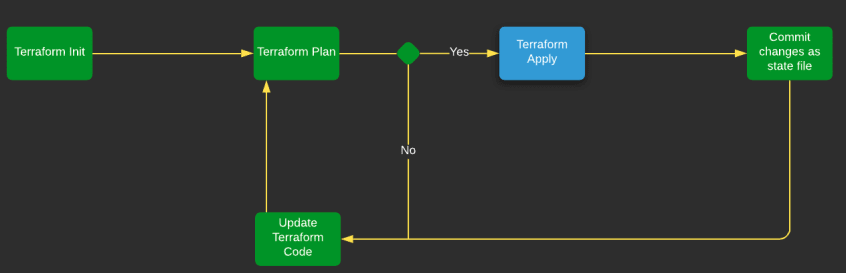

# 02. 테라폼 시작하기


> 이 문서는 책 "테라폼 설치에서 운영까지"을 읽고 작성되었습니다. 최대한 요약해서 책 내용을 최소로 하는데 목표를 두고 있어서, 더 친절하고 정확한 내용을 원하신다면 책을 구매하시는 것을 추천드립니다. => [책 링크](http://www.kyobobook.co.kr/product/detailViewKor.laf?mallGb=KOR&ejkGb=KOR&barcode=9791188621521)

## 2장을 진행하기 위해 필요한 작업

### AWS 계정 설정하기

위 내용은 다음 [링크](https://gurumee92.tistory.com/230?category=933068)를 따라가기를 바란다.

### 테라폼 설치하기

위 내용은 다음 [링크](https://gurumee92.tistory.com/219?category=933068)를 따라가기를 바란다.

## 2장에서 배운 것

### terraform 구성 요소

**provider**

`terraform` 사용하기 위한 요소 중 첫 번째는 바로 `provider`이다. 정확히 인프라스트럭처를 구성하는 공급자를 의미한다. 

```hcl
provider "aws" {
  region = "us-east-1"
}
```

위의 코드는 `provider`, 즉 공급자를 `aws`로 인프라스트럭처를 배포할 `region`을 `us-east-1`로 지정한 것이다. `terraform`으로 인프라스트럭처를 구성하기 위해서는 이 코드가 반드시 필요하다. 보통 `main.tf` 파일에 이 코드를 작성하며 다른 프로그래밍 언어에서 main 함수 역할을 한다고 보면 된다.

`terraform`으로 관리할 수 있는 `provider`의 종류는 다음 [링크](https://registry.terraform.io/browse/providers)에서 더 자세하게 확인할 수 있다.

**resource**

`resource`는 `terraform`으로 관리하는 인프라스트럭처를 구성하는 각 요소라고 보면 된다. `aws`로 보면 `vpc`, `iam`, `ec2`, `rds`, `elb` 등이라고 보면 된다. 다음은 `resource`의 예제이다.

```hcl
resource "aws_instance" "example" {
  image_id = "ami-0d5eff06f840b45e9"
  instance_type = "t2.micro"
}
```

다음은 `aws ec2`의 인스턴스 1개를 `terraform`으로 생성하는 코드이다. 인프라스트럭처의 각 구성 요소들은 대응하는 `resource`들이 존재한다. 모든 `provider`가 지원하는 `resource`들을 한 번에 보긴 힘드니까 `aws`만 살펴보자. `aws`의 `resource`들은 다음 [링크](https://registry.terraform.io/providers/hashicorp/aws/latest/docs)에서 확인할 수 있다. 또한 각 `resource`의 간단한 사용법을 확인할 수 있으며, `image_id`, `instance_type` 등의 `resource`를 구성하는데 필요한 변수들을 확인할 수 있다. 

**variable**

`terraform`은 프로그래밍 언어는 아니지만 프로그래밍 요소를 가지고 있다. 그 중 하나가 변수, `variable`이다. 선언 방법은 다음과 같다.

```hcl
variable "server_port" {
  description = "The port the server will use HTTP requests"
  default = 8080
}
```

`variable`은 `description`, `default`, `type` 등을 지정할 수 있다. `type`의 경우는 `default` 값을 보고 알아서 지정하며 `default`도 지정되지 않으면 `string`이 된다. `variable`의 사용법은 다음과 같다.

```hcl
resource "aws_security_group" "instance" {
  name = "terraform-example-instance"
  ingress {
    # var.server_port를 주목하자!  
    from_port = var.server_port
    to_port = var.server_port
    protocol = "tcp"
    cidr_blocks = ["0.0.0.0/0"]
  }

  lifecycle {
    create_before_destroy = true
  }
}
```

`var.VARIABLE_NAME`으로 `terraform` 코드에서 변수를 사용할 수 있다. 이 경우 `ingress`의 `from_port`, `to_port`가 모두 변수 `server_port`의 값 8080으로 할당된다.

**data**

`data`는 `terraform`의 메인 구성 요소는 아니고 코드를 줄이고 깔끔하게 관리할 수 있도록 `provider`가 제공하는 읽기 전용 정보라고 보면 된다. 선언은 다음과 같다.

```hcl
data "aws_availability_zones" "all" {}
```

`variable`과 흡사하다. 사용 방법도 이와 비슷하다.

```hcl
resource "aws_autoscaling_group" "example" {
  launch_configuration = aws_launch_configuration.example.id
  # 여기를 주목!
  availability_zones = data.aws_availability_zones.all.names

  load_balancers = [aws_elb.example.name]
  health_check_type = "ELB"
  
  min_size = 2
  max_size = 10

  tag {
    key = "Name"
    value = "terraform-asg-example"
    propagate_at_launch = true
  }
}
```

역시 `data.DATA_NAME`으로 `resource`를 구성하는 변수들의 값을 할당할 수가 있다. 각 `provider`가 사용할 수 있는 `data`들도 역시 `terraform registry`에서 확인할 수 있다.

다음 [링크](https://registry.terraform.io/providers/hashicorp/aws/latest/docs)에서 왼쪽 부분에서 `Data Sources`를 살펴본다.

### terraform 명령어

**terraform init**

`terraform init` 명령어는 프로젝트를 `terraform`을 구동할 수 있는 환경으로 만들어준다. 보통 `provider`가 작성된 `main.tf`가 존재하는 경로에서 사용된다. `terraform` 최초 구동 시 반드시 필요한 명령어이다.

**terraform plan**

`terraform plan`은 현재 작성된 `terraform` 코드로 생성되고 변경되는 내역을 보여준다. 실제 환경에 적용하기 전 검증할 수 있게 하는 매우 중요한 명령어이다. 또한 `terraform` 코드의 문법적 오류가 없는지도 검증할 수 있다. 프로그래밍 언어에서 컴파일 단계로 보면 된다.

**terraform apply**

`terraform apply`는 실제로 인프라스트럭처를 구성한다. 역시 생성되고 변경되는 내역을 확인할 수 있다. 프로그래밍 언어로 치면 빌드 및 런타임 단계라고 보면 된다. 

참고로 런타임 오류처럼, 컴파일 단계인 `terraform plan`이 무사히 통과되더라도 `provider`의 제한으로 인해 `terraform apply` 명령어가 실패할 때가 아주 가끔 있다.

**terraform destroy**

`terraform destroy`는 이름 그대로 구성했던 인프라스트럭처의 `resource`를 모두 회수한다. 가끔 `resource` 설정으로 인해서 명령어가 안먹힐 때가 있는데, 그 때를 대비해서 `terraform`으로 강제로 삭제할 수 있도록 설정해두는 것이 좋다.

**terraform 명령어 cycle**

`terraform` 작업은 보통은 위의 4가지 명령어들로 구성된다. 일종의 순환 과정이 생성되는데 그림으로 보면 다음과 같다.



## 2장 전체 코드

2장을 진행하면 완성된 코드는 다음과 같다. 참고로, 책 코드 그대로 진행하면 안되는 부분들이 있기 때문에 책과는 완전 똑같지는 않다.

[src/ch02/main.tf](https://github.com/gurumee92/today-i-learned/blob/master/terraform_up_and_running/src/ch02/main.tf)
```hcl
provider "aws" {
  region = "us-east-1"
}

variable "server_port" {
  description = "The port the server will use HTTP requests"
  default = 8080
}

data "aws_availability_zones" "all" {}

resource "aws_security_group" "instance" {
  name = "terraform-example-instance"
  ingress {
    from_port = var.server_port
    to_port = var.server_port
    protocol = "tcp"
    cidr_blocks = ["0.0.0.0/0"]
  }

  lifecycle {
    create_before_destroy = true
  }
}

resource "aws_security_group" "elb" {
  name = "terraform-example-elb"
  ingress {
    from_port = 80
    to_port = 80
    protocol = "tcp"
    cidr_blocks = ["0.0.0.0/0"]
  }

  egress {
    from_port = 0
    to_port = 0
    protocol = "-1"
    cidr_blocks = ["0.0.0.0/0"]
  }
}


resource "aws_launch_configuration" "example" {
  image_id = "ami-0d5eff06f840b45e9"
  instance_type = "t2.micro"
  security_groups = [aws_security_group.instance.id]

  user_data = <<-EOF
            #!/bin/bash
            echo "Hello, World" > index.html
            nohup python3 -m http.server ${var.server_port} &
            EOF

  lifecycle {
    create_before_destroy = true
  }
}

resource "aws_autoscaling_group" "example" {
  launch_configuration = aws_launch_configuration.example.id
  availability_zones = data.aws_availability_zones.all.names

  load_balancers = [aws_elb.example.name]
  health_check_type = "ELB"
  
  min_size = 2
  max_size = 10

  tag {
    key = "Name"
    value = "terraform-asg-example"
    propagate_at_launch = true
  }
}

resource "aws_elb" "example" {
  name = "terraform-asg-example"
  availability_zones = data.aws_availability_zones.all.names
  security_groups = [aws_security_group.elb.id]

  listener {
    lb_port = 80
    lb_protocol = "http"
    instance_port = var.server_port
    instance_protocol = "http"
  }

  health_check {
    healthy_threshold = 2
    unhealthy_threshold = 2
    timeout = 3
    interval = 30
    target = "HTTP:${var.server_port}/" 
  }
}

output "elb_dns_name" {
  value = aws_elb.example.dns_name  
}
```