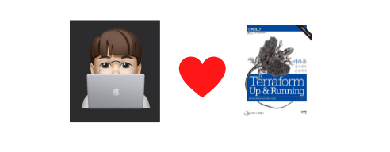

# 03. 테라폼 상태 관리



> 이 문서는 책 "테라폼 설치에서 운영까지"을 읽고 작성되었습니다. 최대한 요약해서 책 내용을 최소로 하는데 목표를 두고 있어서, 더 친절하고 정확한 내용을 원하신다면 책을 구매하시는 것을 추천드립니다. => [책 링크](http://www.kyobobook.co.kr/product/detailViewKor.laf?mallGb=KOR&ejkGb=KOR&barcode=9791188621521)

## 테라폼 상태 파일과 잠금 파일

`terraform init`과 `terraform apply` 명령어를 실행하면 실제로 다음의 파일이 생성된다. 

* .terraform
* .terraform.lock.hcl
* terraform.tfstate

`.terraform.*` 형태의 파일들은 `terraform init` 명령어를 실행할 때 생성되며 `terraform.tfstate`는 `terraform apply` 명령어 실행 후 생성된다. `terraform.tfstate`는 JSON 형태로 되어 있는데, 이는 `terraform`으로 구성된 인프라스터럭처의 현재 상태를 보여준다. 

`.terraform.lock.hcl`은 잠금 파일이며 경쟁 상태에서 생길 수 있는 문제들을 피할 수 있게 해준다. 하지만 개인 프로젝트처럼 개인 혹은 머신 한대에서 `terraform`으로 인프라를 운영한다면 딱히 도움되는 것은 없다. 하지만 팀으로써 운영한다면 얘기가 달라진다. 이 장에서는 `terraform`을 팀으로써 운영할 때 상태 파일을 공유하고, 이 상태 파일을 이용해서 다른 인프라스트럭처 구성 시 어떻게 사용할 수 있는지 공부할 수 있다.

## 테라폼 상태 파일과 잠금 파일 공유 및 분리

먼저 `terraform.tfstate`를 어떻게 공유할까? 제일 간편한 방법은 `git` 같은 소스 코드 버전 관리 도구를 이용해서 공유하는 것이다. 하지만 이 방법은 2가지 측면에서 취약하다고 할 수 있다.

* 수동 실수
* 보안

수동 실수야 조심하면 피할 수 있다쳐도 보안은 어떻게 방법이 없다. `terraform.tfstate`의 경우, 데이터베이스의 비밀번호, 계정 액세스 ID 등 숨겨야 하는 정보가 모두 들어있다. 사내 보안이 잘 구성된 버전 관리 도구를 이용하면 어느 정도 해결되지만 `github`과 같은 외부에 공개된 버전 관리 도구를 사용했을 때는 보안에 매우 취약해질 수 밖에 없다.

다행히 `terraform`은 상태 파일과 잠금 파일을 원격 저장소에 안전하게 저장할 수 있는 방법을 제공한다. 대표적으로 상태 파일은 `AWS S3`, 잠금 파일은 `AWS DynamoDB`를 이용해서 저장하는 방법이 있다. 이를 알아본다. (그 외 `Consul`을 이용하는 방법도 있다.)

먼저 소스 코드 구조를 다음과 같이 만든다.

```
src
  |- ch03
        |- global
            |- s3
                |- main.tf
                |- outputs.tf
        |- stage
            |- services
                |- webserver-cluster (2장 코드)
                    |- main.tf
                    |- outputs.tf
                    |- variables.tf
```

그리고 `global/s3/main.tf`에 다음을 저장한다.

[src/ch03/global/s3/main.tf](https://github.com/gurumee92/today-i-learned/blob/master/terraform_up_and_running/src/ch03/global/s3/main.tf)
```hcl
provider "aws" {
  region = "us-east-1"
}

resource "aws_s3_bucket" "terraform_state" {
  bucket        = "gurumee-terraform-state"
  force_destroy = true

  versioning {
    enabled = true
  }

  lifecycle {
    prevent_destroy = false
  }
}

resource "aws_dynamodb_table" "terraform_lock" {
  name           = "gurumee-terraform-lock"
  hash_key       = "LockID"
  read_capacity  = 2
  write_capacity = 2

  attribute {
    name = "LockID"
    type = "S"
  }
}
```

위 코드는 상태 파일을 저장할 `AWS S3` 버킷 1개, 잠금 파일을 저장할 `AWS DynamoDB` 테이블 1개를 생성한다. `terraform apply`를 통해서 인프라스트럭처를 구성한다. 구성된 결과는 다음과 같다.

**S3 Bucket**


**DynamoDB Table**


이 인프라가 구성되면, `global/s3/main.tf`에 다음을 추가한다.

[src/ch03/global/s3/main.tf](https://github.com/gurumee92/today-i-learned/blob/master/terraform_up_and_running/src/ch03/global/s3/main.tf)
```hcl
terraform {
  backend "s3" {
    bucket         = "gurumee-terraform-state"
    key            = "global/s3/terraform.tfstate"
    region         = "us-east-1"
    encrypt        = true
    dynamodb_table = "gurumee-terraform-lock"
  }
}

# ...
```

그 후 `terraform init`을 실행한다. 그럼 다음 문구가 뜨는 것을 확인할 수 있다.

```bash
$ terraform init

Initializing the backend...
Acquiring state lock. This may take a few moments...
Do you want to copy existing state to the new backend?
  Pre-existing state was found while migrating the previous "local" backend to the
  newly configured "s3" backend. No existing state was found in the newly
  configured "s3" backend. Do you want to copy this state to the new "s3"
  backend? Enter "yes" to copy and "no" to start with an empty state.

  Enter a value:
```

이제 "yes"를 입력한다. 그 후, `AWS S3` 버킷에서는 `<버킷>/global/s3/terraform.tfstate`가 `AWS DynamoDB` 테이블에서 items를 확인해보면 잠금 파일이 각각 추가된 것을 확인할 수 있다.

**S3 Bucket**


**DynamoDB Table**


이런 식으로 각각 인프라스트럭처를 구성하고 상태파일과 잠금파일을 저장하고 분리하면 된다.

## 테라폼 상태 불러오기

이제 인프라스트럭처를 분리하고, 분리된 상태 파일을 이용해서 필요한 정보를 가져올 것이다. 먼저 데이터베이스 인프라스트럭처를 구성하고 그 데이터베이스의 `dns_name`, `port`를 웹 서버 클러스터 인프라스럭처에서 이를 가져올 것이다. 먼저 디렉토리 구조를 다음과 같이 바꾼다.

```
src
  |- ch03
        |- global
            |- s3
                |- main.tf
                |- outputs.tf
        |- stage
            |- data-stores
                |- mysql
                    |- main.tf
                    |- outputs.tf
                    |- variables.tf
                    |- terraform.tfvars
            |- services
                |- webserver-cluster (2장 코드)
                    |- main.tf
                    |- outputs.tf
                    |- variables.tf
```

먼저 데이터베이스 전용 인프라스트럭처를 구성한다. 다음 파일들을 생성한다.

[src/ch03/stage/data-stores/mysql/main.tf](https://github.com/gurumee92/today-i-learned/blob/master/terraform_up_and_running/src/ch03/stage/data-stores/mysql/main.tf)
```hcl
terraform {
  backend "s3" {
    bucket         = "gurumee-terraform-state"
    key            = "stage/data-stores/mysql/terraform.tfstate"
    region         = "us-east-1"
    encrypt        = true
    dynamodb_table = "gurumee-terraform-lock"
  }
}

provider "aws" {
  region = "us-east-1"
}

resource "aws_db_instance" "example" {
  engine              = "mysql"
  allocated_storage   = 10
  instance_class      = "db.t2.micro"
  name                = "example_database"
  username            = "admin"
  password            = var.db_password
  skip_final_snapshot = true
}
```

[src/ch03/stage/data-stores/mysql/outputs.tf](https://github.com/gurumee92/today-i-learned/blob/master/terraform_up_and_running/src/ch03/stage/data-stores/mysql/outputs.tf)
```hcl
output "address" {
  value = aws_db_instance.example.address
}

output "port" {
  value = aws_db_instance.example.port
}
```

[src/ch03/stage/data-stores/mysql/varialbes.tf](https://github.com/gurumee92/today-i-learned/blob/master/terraform_up_and_running/src/ch03/stage/data-stores/mysql/variables.tf)
```hcl
variable "db_password" {
  type        = string
  description = "The password for the database"
}
```

[src/ch03/stage/data-stores/mysql/terraform.tfvars](https://github.com/gurumee92/today-i-learned/blob/master/terraform_up_and_running/src/ch03/stage/data-stores/mysql/terraform.tfvars)
```hcl
db_password = "adminadmin" # 원하는 비밀번호
```

여기서 `outputs.tf`가 중요하다. 이 파일에 저장된 `output` 출력 변수들을 상태 파일을 이용해서 부를 수 있게 된다. 이제 데이터베이스용 인프라스트럭처를 구성한다. 그 후 웹 서비스 클러스터 인프라스트럭처의 코드를 다음처럼 바꿔준다.

[src/ch03/stage/webserver-cluster/main.tf](https://github.com/gurumee92/today-i-learned/blob/master/terraform_up_and_running/src/ch03/stage/services/webserver-cluster/main.tf)
```hcl
terraform {
  backend "s3" {
    bucket         = "gurumee-terraform-state"
    key            = "stage/services/webserver-cluster/terraform.tfstate"
    region         = "us-east-1"
    encrypt        = true
    dynamodb_table = "gurumee-terraform-lock"
  }
}

# 2장과 동일

data "terraform_remote_state" "db" {
  backend = "s3"

  config = {
    bucket = "gurumee-terraform-state"
    key    = "stage/data-stores/mysql/terraform.tfstate"
    region = "us-east-1"
  }
}

resource "aws_launch_configuration" "example" {
  image_id        = "ami-0d5eff06f840b45e9"
  instance_type   = "t2.micro"
  security_groups = [aws_security_group.instance.id]

  user_data = templatefile("user-data.tpl", {
    server_port = var.server_port,
    db_address  = data.terraform_remote_state.db.outputs.address,
    db_port     = data.terraform_remote_state.db.outputs.port,
  })

  lifecycle {
    create_before_destroy = true
  }
}

# 2장과 동일
```

[src/ch03/stage/webserver-cluster/user-data.tpl](https://github.com/gurumee92/today-i-learned/blob/master/terraform_up_and_running/src/ch03/stage/services/webserver-cluster/user-data.tpl)
```tpl
#!/bin/bash
cat > index.html <<EOF
<h1>Hello, World</h1>
<p>DB address: ${db_address}</p>
<p>DB port: ${db_port}</p>
EOF

nohup python3 -m http.server ${server_port} &
```

여기서 다음 코드가 외부 저장소에서 다른 인프라스트럭처의 상태파일을 읽어서 원하는 정보를 가져온다.

```hcl
data "terraform_remote_state" "db" {
  backend = "s3"

  config = {
    # 상태 파일을 저장할 버킷
    bucket = "gurumee-terraform-state"

    # 가져오고 싶은 인프라스트럭처 정보를 지닌 상태 파일
    key    = "stage/data-stores/mysql/terraform.tfstate"
    region = "us-east-1"
  }
}
```

그리고 이 정보를 이용하기 위해서는 `data.terraform_remote_state.db.outputs.<outputs.tf에 저장된 output 변수>` 형식으로 부르면 된다. 해당 코드는 다음과 같다.

```hcl
resource "aws_launch_configuration" "example" {
  image_id        = "ami-0d5eff06f840b45e9"
  instance_type   = "t2.micro"
  security_groups = [aws_security_group.instance.id]

  user_data = templatefile("user-data.tpl", {
    server_port = var.server_port,
    # 여기 코드 주목!!
    db_address  = data.terraform_remote_state.db.outputs.address,
    db_port     = data.terraform_remote_state.db.outputs.port,
  })

  lifecycle {
    create_before_destroy = true
  }
}
```

분리된 상태 파일에 저장된 정보를 이렇게 불러올 수 있다.

## 3장 전체 코드

3장 전체 코드는 다음 [링크](https://github.com/gurumee92/today-i-learned/tree/master/terraform_up_and_running/src/ch03)에서 확인할 수 있다.

* 테라폼 상태 저장소 : [global/s3](https://github.com/gurumee92/today-i-learned/tree/master/terraform_up_and_running/src/ch03/global/s3)
* 데이터베이스 인프라 : [stage/data-stores/mysql](https://github.com/gurumee92/today-i-learned/tree/master/terraform_up_and_running/src/ch03/stage/data-stores/mysql)
* 웹 클러스터 인프라 : [stage/services/webserver-cluster](https://github.com/gurumee92/today-i-learned/tree/master/terraform_up_and_running/src/ch03/stage/services/webserver-cluster)