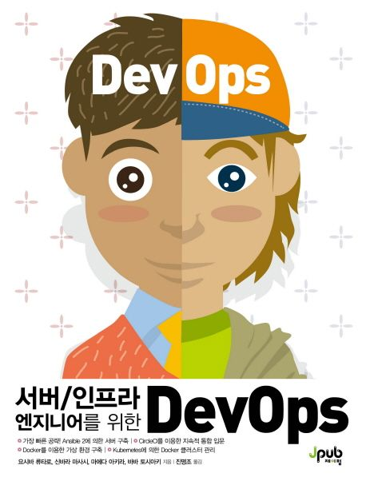
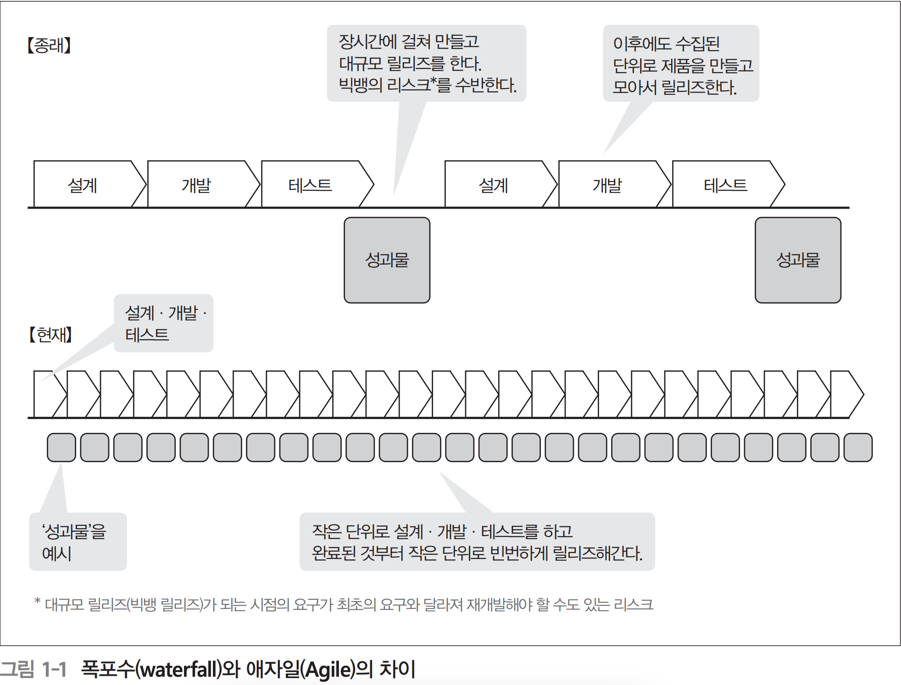
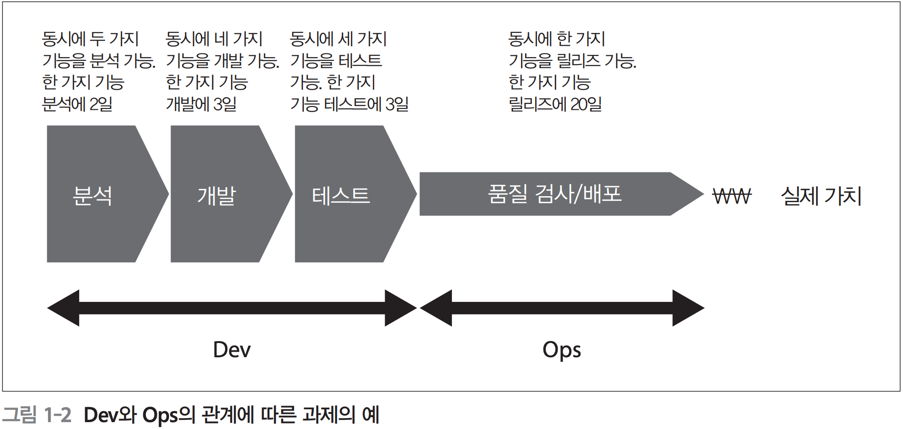
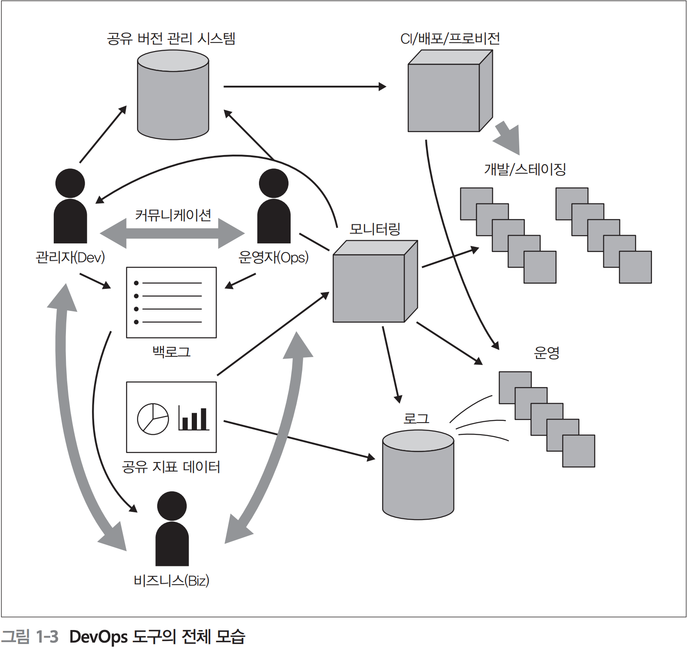
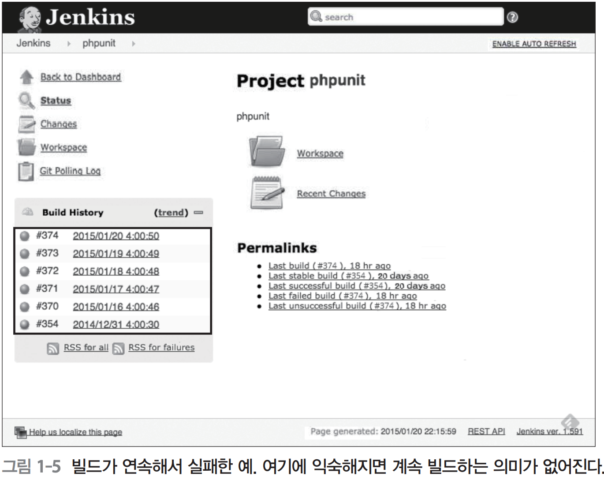

# 서버/인프라 엔지니어를 위한 DevOps

## 차례
* 권두기획
    * DevOps 와 Infrastructure as Code 개요
        * Chapter 1 DevOps 란?
            * DevOps 의 본질을 이해하고 실천하자
        * Chapter 2 Infrastructure as Code 란?
            * 코드에 의한 인프라 구축의 자동화
* 특집 1
    * 가장 빠른 공략! Ansible 2에 의한 서버 구축
        * 복잡한 태스크를 멱등성을 유지하며 자동화 하는 툴
        * Chapter 1 Ansible 의 기본
            * 대상 호스트를 지정해서 태스크를 실행한다
        * Chapter 2 Playbook 의 기본
            * 대상 호스트에서 실행할 태스크를 기술한다
        * Chapter 3 실전 Ansible
            * LAPP 서버를 구축해서 애플리케이션을 배포한다
        * Chapter 4 Playbook 의 올바른 접근 방법
            * Playbook 을 분할해서 구조화 한다
* 특집 2
    * CircleCI 를 이용한 지속적 통합 입문
        * 테스트 주도 인프라의 기초부터 지속적 통합까지
        * Chapter 1 인프라 테스트 입문
            * 테스트 주도 인프라와 인프라 CI
        * Chapter 2 로컬에서의 테스트 주도 인프라
            * VirtualBox, Vagrant, knife-solo, serverspec 의 설정
        * Chapter 3 인프라CI의 준비
            * GitHub, CircleCI DigitalOcean 의 설정
        * Chapter 4 CircleCI를 이용한 지속적 통합
            * 실전 인프라 코드 작성
        Chapter 4 지속적 통합에서 지속정 인도로
            * 운영 환경에 인프라CI 적용
* 특집 3
    * Docker 를 이용한 가상 환경 구축과 Kubernetes 에 의한 Docker 클러스터 관리
        * 컨테이너 기술이 실현하는 새로운 세계
    * Chapter 1 Docker 의 기본
        * Docker 의 기본
            * 데몬과 명령에 의한 컨테이너 관리
        * Chapter 2 Docker 를 사용해보자[기본편]
            * Docker 컨테이너의 기본 제어
        * Chapter 3 Docker 를 사용해보자[응용편]
            * Docker 컨테이너의 실행 옵션, Dockerfile 의 활용
        * Chapter 4 클러스터 관리 도구란?
            * 복수의 Docker 컨테이너 관리
        * Chapter 5 Kubernetes 의 기본
            * 기본 개념과 구성 요소를 이해하자
        * Chapter 6 Kubernetes 의 기본
            * 검증 환경 구축과 샘플 실행
        * Chapter 7 Kubernetes 를 자세히 살펴보기
            * 고도의 클러스터 관리를 실현하기 위해

# 권두 기획
## DevOps 와 Infrastructure as Code 개요

**비즈니스에 공헌하는 IT** 
* 비즈니스 환경에 지속저으로 변화해가는 가운데 IT 가 경영에 공헌하기 위해서는 개발자와 운영자 사이에 벽을 허물고 진정한 가치에 집중하면서 개선하는 게 중요하다. 최근 개발자와 운영자가 협력해서 개발하는 방법으로 DevOps 가 주목을 모으고 있는 데 협력이라고 하면 실제로 어떤 작업을 하는 것인지 어디서부터 시작해야 좋을 지 모르는 사람도 많을 것이다.
* 권두기획에서는 DevOps 를 시작하면서 알아두어야 할 내용으로 DevOps 란 무엇인지 그리고 이를 추진하기 위해 이용하는 도구와 DevOps 의 요소 중 하나인 Infrastructure as Code 에 관해 설명한다.

## Chapter 1 DevOps 란?
### DevOps 의 본질을 이해하고 실천하자
이 장에서는 DevOps 라는 개념이 생겨난 배경을 고찰하고 DevOps 란 무엇인지를 설명한다. 또한 DevOps 를 실천할 떄의 주의점을 살펴보고 도구 도입 방법에 관해서도 설명한다

### 비즈니스의 속도와 소프트웨어의 역활 변화
사람이 수작업으로 했던 작업을 대체하고 대량의 데이터를 처리하는 업무 효율화를 목적으로 일찍이 수많은 소프트웨어가 만들어졌다. 이러한 소프트웨어 개발은 최초에 요구를 명확히 정의하기가 비교적 쉽고 일단 필요한 기능을 만들어서 사용하기 시작하면 큰 변경 없이 오랜 기간 계속 이용하는 일이 많았다. 이것은 하드웨어 비용이나 소프트웨어 개발 비용이 비쌌던 것도 그 이유 중 하나다.

물론 이러한 소프트웨어는 지금도 만들어지고 있지만, 현재는 비즈니스 자체를 위해 만드는 비율이 매우 높아지고 있다. 스타트업 기업이 짧은 기간과 적은 자금으로 소프트웨어를 이용 해서 서비스를 시작하고 시장을 획득해서 성장을 이어나가는 이야기도 많이 있으며, 종래의 기업은 자사 비즈니스의 경쟁에서 이기기 위해 경쟁의 원동력이 되는 소프트웨어를 개발하거나, 사업 다각화를 위해 기존 시장과는 다른 영역의 소프트웨어를 만들어 신규 비즈니스에 참여하고 있다. 즉, 이전과 비교해서 소프트웨어가 비즈니스 그 자체에 공헌해야 한다는 요구가 커져 비즈니스 환경의 속도에 맞춰 소프트웨어 개발이 이루어져야 하는 상황이 된 것이다.

### 소프트웨어 개발 프로세스의 변화
이러한 상황에서는 소프트웨어 개발이 다음과 같은 특징을 지닌다.
* 사전에 사양을 상세하게 정할 수 없거나 정하는 게 의미가 없다.
* 장시간에 걸쳐 100% 완성도를 갖는 소프트웨어를 만드는 것보다 TTM(Time To Market, 제품을 만들어 시장에 내놓는 데까지 걸리는 시간)이 우선시되는 경우가 많다.
* 만든 후에도 이용자의 피드백을 받아가며 기능을 계속 개선해야 한다.

종래의 소프트웨어 개발에서 자주 사용되던 것은 폭포수(waterfall) 방식이었다(그림 1-1의 위). 이는 최초에 요구를 수집하고 그 요구가 올바르다는 것을 전제로 해서 설계, 개발, 테스트와 같은 단계로 분할해서 진행하는 것이다. 소프트웨어는 최종 테스트가 끝난 단계에서 처음으로 이용 가능해진다.

이 방식은 최초에 수집한 요구가 올바르며 도중에 변화하지 않는 소프트웨어를 만드는 데는 유효하지만, 반대로 말하면 요구가 올바른지 어떤지를 평가해보지 않으면 알 수 없는 제품 또는 요구가 도중에 변화할 가능성이 있는 제품을 만들 경우에는 제대로 작동하지 않는다. 이 경우에는 스크럼(Scrum)이나 익스트림 프로그래밍(eXtreme Programming, XP)을 비롯한 애자일(Agile) 개발 방식을 채택하는 게 적합하다.

애자일 개발에서도 최초에 요구를 수집하지만, 이 요구에 우선순위를 매겨 순위가 높은 것부터 차례로 하나씩 설계, 개발, 테스트를 해간다(그림 1-1의 아래). 만든 것은 정기적으로 리뷰하고, 문제가 없으면 그 시점에서 릴리즈할 수 있다(스크럼에서는 이를 출시 가능한 제품(Potentially Shippable Product)이라고 한다. 실제 출시 여부와는 별개다). 또한, 외부로부터 피드백을 받아서 새로운 기능 요구를 작성하고 그 우선순위를 높여 빠르게 대응할 수도 있다. 물론 만드는 도중에 비즈니스 상 수익을 올릴 수 없다고 판명된 경우에는 그 시점에서 개발을 중지하면 불필요한 비용을 지급하는 일도 없게 된다.

스타트업 기업의 최대 리스크는 아무도 필요로 하지 않는 것을 만드는 것이다. 따라서 장시간에 걸쳐 스텔스 모드로 거대한 것을 만드는 게 아니라, 최소 기능 제품(Minimum ViableProduct, MVP)을 먼저 만들어보고 그에 대한 사용자의 피드백을 받아가며 나아갈 방향을 결정해가게 된다. 이것도 앞서 말한 방식을 따른 것이라고 할 수 있다.



### 개발과 운영의 대립
한편으로, 애자일 개발이라는 개념에서는 시스템을 어떻게 운용할 것인지에 대해서는 그다지 고려하지 않는다. 스크럼에서는 스크럼팀이 직접 제품을 전달할 수 있는 능력을 갖출 것을 요구하고 있지만, 이
는 바꿔 말하면 본래는 운영 환경 구축이나 소프트웨어 배포, 그리고 장애 시의 대응도 포함 해서 스크럼팀에서 대응하는 것을 의미한다. 다만 안타깝게도 많은 경우에 조직적인 이유로 인해 소프트웨어 개발자(Dev)와 시스템 운영자(Ops)가 나누어져 있다. 이때 소프트웨어 개발자는 새로운 기능을 만드는 역할을 맡지만, 운영 담당자는 시스템을 안정적으로 운영하는 역할을 맡는다. 애자일 개발에 따라 개발 사이클이 빨라져 빈번하게 릴리즈하고 싶지만, 한편으로 운영 담당자는 시스템을 안정적으로 운용하기 위해 변화를 주고 싶지 않은, 서로 다른 대립구조가 문제가 되었다. 그러나 이 대립구조에 의해 소프트웨어를 빈번하게 릴리즈할 수 없게 되면 비즈니스에도 영향을 주게 된다. 그리하여 주목받게 된 것이 DevOps라는 사고방식이다.

### DevOps란?
DevOps는 개발자(Dev)와 운영자(Ops)가 상호 협력해가면서 비즈니스의 가치를 실현하는 개념을 가리킨다. 이는 개념이므로 정해진 방법론이 있는 것은 아니다.

DevOps가 주목받기 시작한 것은 2009년 6월에 캘리포니아 주 산호세에서 오라일리 주최로 열린 ‘Velocity 2009’ 행사에서, 당시 플리커(Flickr)에 소속된 존 올스포(John Allspaw)와 폴 해먼
드(Paul Hammond)의 프레젠테이션1 을 통해서다.

‘10+ Deploys Per Day: Dev and Ops Cooperation at Flickr(1일 10회 이상의 배포: Flickr에 의한 개발과 운용의 협력 관계)’라는 제목의 프레젠테이션에서 비즈니스 가치를 계속해서 전달하기 위해 개발자(Dev)와 운영자(Ops)가 집중해야 하는 것에 대해 조직의 문화와 도구 관점에서 다음과 같이 제시하고 있다.

#### 조직의 문화
1. 상호 존중(Respect)
2. 상호 신뢰(Trust)
3. 실패에 대한 건전한 태도(Healthy attitude about failure)
4. 상대를 비난하지 않기(Avoiding Blame)

#### 도구
1. 자동화된 인프라(Automated Infrastructure)
2. 버전 관리 시스템의 공유(Shared version control)
3. 원스텝 빌드와 배포(One step build and deploy)
4. 피처 플래그(Feature flags)2
5. 지표 데이터3 의 공유(Shared metrics)
6. IRC와 인스턴트 메신저 봇4 (IRC and IM robots)

나열된 항목은 여러 갈래에 걸쳐 있어 좀 더 세부적인 것까지는 언급되지는 않았지만, 정리해 보면 비즈니스의 목적을 달성하기 위해서는 조직과 도구 양면에서 개선해나가야 한다는 것을 알 수 있다. 그리고 이러한 활동 전반을 DevOps라고 한다. 

또한, 이후의 DevOps 활동 가운데 DevOps를 구성하는 요소를 CLAMS(Culture, Lean, Automation, Measurement, Sharing)라는 다섯 가지 분야로 정리하고 있다. 이는 문화, 린(낭비 제
거), 자동화, 측정, 공유를 가리킨다.

### 조직에서의 DevOps 적용과 추진
그렇다면 조직에서 DevOps를 어떻게 적용해가면 좋을까? 사실은 DevOps뿐만 아니라 뭔가 새로운 것을 조직에 적용할 경우에 가장 먼저 생각해야 할 점은 ‘도대체 지금 무엇 때문에 어려움을 겪고 있는가 ’, 지금 해결해야 할 과제는 무엇인가?’라는 것이다. 방법이나 도구는 솔루션 중 하나에 지나지 않으며, 방법이나 도구의 도입 자체가 목적이 되지 않도록 해야 한다는 것이다. 그리고 과제의 종류에 따라서는 단순히 개발 부문이나 운영 부문 내에 갇혀서 개선하는 게 아니라, 전사에 걸쳐 조직적인 과제로서 해결을 도모하는 것도 필요하다. 

예를 들면 DevOps의 대처 방안 중 하나로 자주 언급되는 항목으로 Infrastructure as Code가 있다. 이는 인프라 구축을 수작업으로 하는 게 아니라, 코드로 작성해서 자동화함으로써 구축 시간이나 실수를 줄이고 재사용성을 높이는 것을 목적으로 하고 있다. 그러나 현재 상황에서의 과제가 소프트웨어의 구축이나 전달에 시간이 오래 걸려 고객의 기대에 부합하지 않는 다면 갑자기 처음부터 이 방안을 적용하는 것이 적절하다고 할 수는 없다.

그림 1-2는 임의의 현장을 예로 든 것이다. Dev 측에서는 요구 분석, 개발, 테스트까지를 시행하고, Ops 측에서는 품질 검사와 배포를 한다. 각각의 공정에서의 속도나 능력은 그림에 나타낸 대로지만, 이 예에서 Dev 측은 동시에 여러 기능을 개발할 수 있어 각각의 공정을 며칠 만에 끝마칠 수 있는 반면에, Ops 측의 품질 검사와 배포는 동시에 복수로 처리될 수 없고, 게다가 시간도 상당히 소요된다. 이 예를 보면, 비즈니스의 병목이 되는 것은 Ops 측의 품질 검사와 배포 프로세스라는 것을 알 수 있다. 따라서 먼저 개선되어야 할 항목은 이러한 프로세스다.



그림 1-2와 같은 예를 포함하여 DevOps는 다음과 같은 흐름으로 적용된다.
* 먼저 비즈니스와 IT의 관계에서 과제를 도출한다.
* 과제에 대해 해결 우선순위를 설정한다.
* 각각의 과제에 대해 향후 모습, 해결했는지를 확인하기 위한 지표 데이터(metric), 달성 목표 시기, 그리고 과제 해결을 진척시키기 위한 체제를 정한다.

물론 과제에 우선순위를 설정하고 대처하더라도 하나를 해결하면 또 다른 우선순위가 높은 과제가 나타날 수도 있고, 애초에 과제가 제대로 해결되지 않을 가능성도 있다. 따라서 정기적으로 다음과 같은 대처를 해야 한다.
* 현재 상황이 어떻게 될지를 지표 데이터를 보면서 확인한다.
* 해결한 과제와 미해결 과제를 명확히 한다. 새로운 과제가 나온 경우에는 이 또한 관리한다.
* 필요에 따라 과제의 우선순위를 수정한다

이것은 말하자면 DevOps의 적용 및 추진을 애자일 방식으로 진행하는 것이다.    

한편, 앞서 말했듯이 조직 구조에 관한 과제는 가장 어려운 과제 중 하나로, 매니지먼트의 오너십 또는 스폰서십이 없으면 이를 수행할 수가 없다. 조직구조 변경, 인재채용 방법이나 모집요강(job description) 변경, 평가체계 변경 등은 개발이나 운영 부문이 추진하기는 어렵다. 상향식(bottom-up)에 의한 DevOps 추진뿐만 아니라 경영 과제로서 하향식(top-down)으로 DevOps를 추진해야 할 필요도 있는 것이다.

### DevOps에서의 도구 도입
앞서 설명했듯이, DevOps를 추진하려면 조직과 도구라는 두 가지 측면에서 검토해야 한다. 조직 측면에서의 개선은 기업의 이해관계자가 많아 달성하기까지 상당히 오랜 시간이 걸리는 반면, 도구의 경우에는 어느 정도 현장의 판단으로 도입할 수 있는 경우도 많다. 조직 측면에서의 대응을 병행해가면서 도구 측면에서의 과제를 해결해가도록 하자.

여기서는 도구 도입 방법에 관해서 설명하겠다.

#### 도구 활용과 목표
도구 활용이라고 가볍게 말은 했지만, 이후의 장에서도 나오듯이 개발 현장에서 이용하는 도구는 상당히 여러 분야에 걸쳐 있다. 도구를 도입할 때 모든 도구를 아무렇게나 마구 도입하려고 하면 효과는 쉽게 나타나지 않으며, 오히려 혼란만 일으키게 된다. 따라서 앞서 DevOps를 적용할 부분에 관해 설명했듯이 계획적으로 추진해야 한다.

도구 도입의 흐름은 다음과 같이 이루어진다.
* 우선 전체 모습이나 목표를 명확히 한다.
* 현재 어떤 상태인지, 목표보다 무엇이 부족한지를 분석한다.
* 도구 도입 계획을 생각해보고 그에 따라 단계적으로 도입한다.
* 도구 도입 후에 애초 생각했던 전체 모습이나 목표에 가까워졌는지, 과제가 없는지를 확인해서 대응한다.

DevOps를 실현했을 때의 전체 모습은 일반적으로 그림 1-3과 같은 형태가 되며, 다음과 같은 작업을 수행한다.
* 커뮤니케이션 도구를 사용해서 관련자 간 커뮤니케이션을 원활히 한다.
* 개발팀이나 운영팀은 버전 관리 시스템에 시스템 소스코드나 설정 정보를 저장한다.
* 다양한 요건이나 과제, 작업이나 오류를 프로젝트 관리 도구로 관리한다.
* 소프트웨어 테스트를 자동화한다.
* 지속적 통합(Continuous Integration, CI; 뒤에서 설명함) 도구를 사용해서 빌드와 테스트를 상시 실시한다.
* 배포 도구를 사용해서 다양한 환경에 소프트웨어를 배치한다.
* 개발이나 검증에는 가상화 도구를 사용해서 모두 같은 환경을 이용한다.
* 프로비저닝 도구나 구성 관리 도구를 사용해서 환경 구축을 자동화한다.
* 모니터링 도구를 사용해서 운영 환경을 모니터링하고 그 결과를 받아서 문제를 발견하거나 프로세스를 개선한다.
* 다양한 지표 데이터를 집약한 대시보드를 통해 모두가 정보를 볼 수 있게 한다.



## 도구 도입 순서
앞서 말했듯이, DevOps에는 많은 도구가 등장하지만, 도구 도입에는 전후 관계나 의존 관계가 있다. 여기서는 도구 도입 순서를 살펴보자.

### 모든 시작점은 버전 관리
가장 먼저 마주해야 할 것은 버전 관리 도구의 도입과 철저한 이용이다.

비즈니스의 변화에 대응하기 위해 소스코드를 빈번하게 변경하게 된다. 따라서 언제•누가•어떤 변경을•무엇 때문에 했는지를 추적할 수 있도록 해야 한다. 또한, 릴리즈 시기가 다른 복수의 버전을 병행해서 개발하는 경우도 많아지므로 버전 관리 도구의 브랜치(branch) 기능이나 머지(merge) 기능을 잘 활용해야 한다.

파일 서버에 의한 코드 공유나 라이브러리언(librarian, 라이브러리의 등록, 삭제, 갱신을 담당하는 사람)에 의한 코드 제공과 머지로는 빠르게 추적할 수 없고 실수를 하게 될 위험성을 줄일 수 없다. 또한, 이미 버전 관리 시스템을 사용하고 있는 경우라도 충분히 활용하지 못해 개발의 병목이 되는 경우도 많이 있다(Git이나 Subversion을 사용하고 있는데, 운영 규칙으로 배타적 잠금(exclusive lock)을 하는 웃지 못할 얘기를 들은 적도 있다).

버전 관리 시스템은 개발팀과 운영팀뿐만 아니라 프로젝트 관련자는 모두 이용하게 되므로 워크플로를 비롯해 필요한 기능을 완전하게 활용할 수 있도록 교육하는 게 중요하다. 테스트 자동화나 지속적 통합은 버전 관리 시스템에 강하게 의존하고 있다. 이것이 잘 안 된다면 다른 도구를 도입하는 것은 의미가 없다고 해도 과언이 아니다.

### 프로젝트 관리 도구
버전 관리 시스템 다음으로 도입할 도구는 GitHub의 Issue나 Redmine과 같은 프로젝트 관리 도구다.

빠른 사이클로 이루어지는 개발에서는 매일 새로운 요구와 요청 사항이 나오거나 장애 대응 및 개선 작업을 해야 한다. 이러한 내용은 프로젝트로서 항상 일원적으로 관리하고 우선순위 관리나 진척도 확인을 해야 한다. 스프레드시트를 사용해서 첨부 메일이나 파일 서버 경유로 주고받게 되면 데이터나 파일이 손상될 위험을 피할 수 없다. 실시간으로 갱신하려면 번거로워 최신 정보를 프로젝트 내에서 공유하는 것도 어려워진다.

이러한 문제에 대응하기 위해서도 전용 프로젝트 관리 도구를 이용해야 한다. 예를 들어 Redmine에서는 과제나 요구별로 티켓을 만들어서 우선도나 기한을 설정해서 대응해간다(플러그인을 이용하면 우선순위를 설정할 수도 있다). 또한, 버전 관리 시스템과의 연계 설정을 반드시 하도록 한다. 버전 관리 시스템으로 커밋할 때 티켓 번호를 포함함으로써 어떤 과제를 위해 어떤 변경을 했는지를 추적할 가능성을 확보할 수 있게 된다(그림 1-4).


```
# git commit -m "refs #448 패스워드 적합성 규칙을 추가"
```

팀에 따라서는 커밋할 때 티켓 번호가 포함되어 있지 않으면 커밋을 거부하도록 설정하기도 한다.
프로젝트 관리 도구에 대해서도 개발팀, 운영팀을 막론하고 모두가 통일된 방법으로 사용하는 것이 중요하다.

### 테스트 자동화
다음으로 대응해야 할 것은 테스트 자동화다. 빈번하게 기능을 추가하거나 릴리즈를 할 경우 시스템 전체가 정상적으로 동작하는지를 항상 검증해야 한다. 이 검증 작업을 테스트 절차서에 따라 수작업으로 하려고 하면 매번 시간이 굉장히 많이 걸리게 된다. 시스템 규모가 커짐에 따라 테스트에 걸리는 시간도 늘어나므로 개발 속도가 점점 느려지게 된다. 이러한 상황을 방지하기 위해서는 JUnit이나 PHPUnit과 같은 유닛 테스트 도구나 브라우저 조작을 자동화하는 Selenium 같은 도구를 이용해서 테스트를 자동화한다.

테스트를 자동화할 때 주의해야 할 점으로는, 가능한 한 개발 초기부터 테스트를 자동화할 것, 반면 모든 것을 자동화하는 것은 비용면에서 현실적이지 않은 경우도 있으므로 테스트 시행 예상 횟수를 생각하면서 효과가 높은 것부터 대처할 것, 테스트 내용에 따라 이용할 도구를 구분할 것과 같은 사항들을 들 수 있다.

예를 들어 모든 테스트를 Selenium을 사용해서 하는 것은 효율적이지 않다. GUI 테스트는 화면 디자인 변경에 따라 테스트 자체가 동작하지 않는 것과 같이 유지보수의 문제도 있다. 복수의 화면에 걸쳐 있는 테스트에는 Selenium이 유효하지만, 라이브러리의 동작 테스트와 같이 GUI에 의존하지 않는 부분은 분리해서 테스트하기 바란다.

### 지속적 통합 도구 도입
버전 관리, 프로젝트 관리, 테스트 자동화를 위한 도구 도입 후에 해야 할 것은 Jenkins나 CircleCI와 같은 지속적 통합 도구를 도입하는 것이다.

지속적 통합에서는 Git과 같은 버전 관리 시스템에서 소스코드를 추출해서 Maven과 같은 빌드 도구로 빌드를 실행하고 자동화된 테스트를 실행한다. 이렇게 하면 버전 관리 시스템에 소스코드를 커밋한 시점에 자동으로 빌드하고 테스트를 실행해 문제가 없는지를 검출할 수 있다. 항상 문제가 없는지를 계속 확인함으로써 어떤 변경이 문제를 일으켰는지 검출하기 쉬워져 그에 대한 대응도 쉬워진다. 또한, 특정 단말에서만 빌드할 수 있는 상황에서도 벗어날 수 있게 된다. 게다가 한 발 나아가 문서를 자동 생성하거나 소스코드를 정적 분석해서 품질에 문제가 없는지를 점검할 수도 있다.

지속적 통합을 도입할 때에도 팀 전원이 통일된 사용법으로 이용하는 것이 중요하다. 예를 들면, 빌드에 실패한 경우에는 빌드 실패를 수정하는 코드 이외에는 버전 관리 시스템에 커밋하지 않는다는 룰을 팀에서 철저하게 지키면 항상 품질을 담보할 수 있게 된다. 이를 철저하게 하려고 빌드가 실패한 경우에 파트 램프를 점멸하거나 채팅 도구에 실패를 통지하는 것도 일반적인 테크닉이다. 반대로 빌드에 실패하더라도 당연한 상황인 것처럼 익숙해져 버리면 언제 무슨 일로 인해 문제가 발생했는지 몰라서 결과적으로 품질에 자신을 가질 수 없게 된다(그림 1-5).



이와 같은 프로세스를 안정적으로 운영할 수 있게 되면, 여기서 한 발 더 나아가 지속적 통합 도구에서 배포 도구를 호출해서 소프트웨어를 다양한 환경에 배포할 수도 있게 된다. 이것이 개발팀으로서 우선 목표로 삼아야 할 목표다.

물론 매일 운용하는 가운데 발견한 개선점을 프로세스에 포함시켜 도구 설정을 고치고 새로운 도구를 추가함으로써 속도나 품질을 좀 더 향상해가는 것도 중요하다.

### 가상 환경 구축 도구 도입
지금까지 주로 소프트웨어 개발 프로세스의 개선이라는 관점에서 도구를 살펴봤는데, 한편으로 환경 구축에서도 도구를 활용해서 효율과 품질을 향상시킬 수 있다.

먼저 해야 할 것은, Vagrant와 같은 가상 환경 구축 도구를 사용해 개발 환경을 균질화하는 것이다. 어떤 개발자의 개발 환경에서 동작한 코드가 다른 개발자의 환경에서는 동작하지 않는 형태의 문제나, 운영 환경에 배포해보니 동작하지 않는 식의 환경 차이에 따라 발생하는 문제, 유사시에 수작업으로 환경을 구축함으로써 시간을 낭비하게 되는 문제를 해결하기 위해서는 가상화가 효과적이다.

프로젝트 초기 단계에서 환경을 가상화해두면 각 멤버의 개발 환경이나 지속적 통합 도구 내에서 이용하는 테스트 환경에도 이용할 수 있으므로 상당히 효과적이다.

그렇다고 해도 가상 환경에서 각자가 생각하는 대로 환경을 구축하게 되면 종래의 방식과 큰 차이가 없으므로, 가상 환경의 모형(템플릿이나 머신 이미지라고도 한다)을 마련해서 이를 모두에게 배포해서 이용하도록 하기 바란다. 모형을 파일 서버에 공유하고 모형 작성을 위한 스크립트를 버전 관리 도구에 등록해서 누구나 추출할 수 있도록 하는 대응책이 필요하다.

### 프로비저닝 도구 도입
가상 환경 구축 도구를 도입한 다음에는, Chef나 Ansible과 같은 프로비저닝 도구를 도입해 인프라 구축을 자동화한다.

시스템 개발에서는 개발 환경, 테스트 환경, 스테이징 환경, 운영 환경 같은 다양한 환경이 존재한다. 이러한 환경을 설치 문서에 기반을 두고 수작업으로 구축하려고 하면 상당히 많은 시간이 걸리거나 작업할 때 실수하는 등의 문제가 발생한다. 이러한 문제를 막기 위해 전용 도구를 사용해서 자동화하면 항상 같은 방법으로 새로운 환경을 구축하거나 패치를 적용할 수 있다.

주의할 점으로, 프로비저닝 도구 도입은 기존 작업 프로세스를 크게 바꾸게 된다. 일단 도구를 사용해서 자동화하면 이후의 변경 작업은 모두 도구를 사용해서 수행해야 한다. 따라서 팀 내에 준비가 충분히 되지 않은 상태에서 도구를 도입하면 업무에 혼란을 초래하거나, 때에 따라서는 오히려 장애를 유발할 가능성이 있다. 시스템 규모에 따라서는 자동화하더라도 충분한 효과가 나타나지 않을 가능성도 생각해야 하므로 도입할 때는 장단점을 충분히 검토하기 바란다

### 모니터링 도구 도입
개발 사이클을 줄이고 빈번하게 소프트웨어를 배포할 수 있게 되면 다음으로 중요한 것이 시스템 모니터링이다. 모니터링 도구 중에 오픈소스로는 Sensu, Zabbix, Nagios와 같은 도구가 사용된다. 또한, 다수의 상용 도구가 있다. 물론 이 책에서 소개하는 도구의 도입 여부에 관계없이, 운영 환경 시스템이라면 시스템이 정상으로 가동하고 있는지를 모니터링해야 한다는 것은 두말할 필요도 없다. 모니터링 도구를 도입하는 이유는 단순히 장애가 발생했는지를 계속 확인하기 위해서만은 아니다. 다양한 데이터를 얻음으로써 개발 프로세스의 문제, 시스템에 혼재해 있는 과제, 인프라 구성의 개선 포
인트를 발견하고 개발 사이클 전체에 대해 피드백하는 것도 목적 중 하나다. 이와 함께, 예를 들어 회원 등록자 수, 1일 매출, 현재 접속 상황 등 좀 더 비즈니스에 가까운 데이터도 얻어 대시보드에 표시하고 빈번하게 확인함으로써 비즈니스상 판단이 쉬워지거나 릴리즈한 기능의 유효성을 파악하고 계속해서 기능을 더 개선할지를 판단할 수도 있게 된다.

도입할 때 주의해야 할 점은, 무엇을 위해 해당 지표 데이터를 모니터링하는지를 사전에 정해 두는 것이다. 모니터링 도구를 사용함으로써 다양한 데이터를 얻더라도 이를 이용해서 어떠한 행동으로 이어가지 못한다면 무의미해지게 되기 때문이다. 또한, 지표 데이터가 도움되지 않는 경우나 임계치가 예상한 것과는 다른 경우에는 모니터링의 정의를 변경할 수 있어야 한다.

### 도구 도입의 올바른 접근 방법
이 책에서 소개한 도구 이외에도 개발 현장에서 사용할 수 있는 도구와 사용해야만 하는 도구는 많이 있다. 이 장의 마지막으로 도구를 도입할 때 올바른 접근 방법을 소개한다.

#### 도입 이유를 명확히 한다
그냥 유행하고 있으니 도구를 도입하겠다는 접근 방식으로는 제대로 해나갈 수 없다. 현재 어떤 과제가 있는지, 무엇을 우선 해결해야만 하는지를 명확히 하기 바란다. 도구 도입에는 시간
과 비용 모두 소요된다. 헛되이 쓰이지 않도록 계획적으로 진행하도록 하자.

#### 도구는 사실상 표준인 것을 선택한다
버전 관리 도구, 과제 관리 도구와 같이 각 장르의 도구는 상용 제품, 오픈소스 제품을 포함해 많은 종류가 존재한다. 그렇다면 어떻게 도구를 선택하면 좋을까? 

그 해법 중 하나로, 가능한 한 사실상 표준인 것을 선택한다는 것이 필자가 권장하는 방식이다. 사실상 표준인 도구는 제품으로서 안정화되어 있고 뭔가 곤란한 일이 생기더라도 인터넷이나 서적에서 많은 정보를 얻을 수 있다. 도구를 사용할 때 불필요한 시간이 걸린다면 주객이 전도되므로 주의하기 바란다.

#### 한 번에 많은 도구를 도입하지 말고 교육과 정착을 확인한다
현재 그다지 도구를 이용하고 있지 않은 환경이라면 이 책에서 소개한 도구를 일단 도입해보고 싶을 것이다. 그러나 동시에 다수의 도구를 도입하더라도 제대로 효과를 내지 못하는 경우가 대다수다.

도구 도입에 따라 일상의 업무 처리 방식이 바뀌게 되므로 한 번에 많은 도구를 도입하려고하면 현장은 혼란에 빠지게 된다. 그렇지 않고 도구를 서서히 도입하면서 자신들의 업무 처리방식을 조금씩 좋은 쪽으로 바꿔나가는 게 최상이다. 도구를 도입하더라도 얼마 지나지 않아 모두가 사용하지 않게 되는 일이 없도록 철저하게 교육하고 주지시켜 착실하게 도구 이용을 안착시킬 수 있도록 하기 바란다.

#### 유지보수는 스스로 한다
앞서 말했듯이, 자신들의 업무 처리방식이 바뀌면 도구의 설정을 변경하거나 새로운 플러그인을 도입하고자 하는 생각을 하게 되는 경우가 종종 있다. 이때 도구 관리를 다른 사람에게 맡기게 되면 곧바로 대응할 수가 없게 된다. 가능한 한 도구의 유지보수는 팀 내에서 할 수 있도록 해두는 게 좋을 것이다.

## Chapter 2 Infrasturucture as Code 란?
### 코드에 의한 인프라 구축의 자동화
---
제1장에서는 DevOps란 무엇이고 어떻게 도입할지를 살펴봤다. 이 장에서는 DevOps 의 대응 방안 중 하나로 많이 거론되는 Infrasturucture as Code 에 관해 살펴보자

### Infrasturucture as Code 란?
Infrasturucture as Code 란 간단히 말하면 자동화된 인프라를 실현하기 위한 방법 중 하나로 지금까지 수작업으로 해오던 인프라 구축이나 변경 작업을 코드로 작성해서 자동화하는 것이다. 그렇다면 왜 인프라 구축이나 변경 작업을 코드로 자동화해야 할까?

### 기존 방식의 인프라 구축의 문제점
기존에 인프라를 구축할 때는 사전에 가이드라인이나 체크리스트를 준비해두고 이 가이드라인에 따라 사람이 하나씩 작업하는 것이 일반적이었다. 예를 들면 서버를 구축하는 경우에는 터미널 프로그램을 사용해 SSH 로 서버에 접속해서 패키를 설치하거나 설정하는 형태다. 그러나 이 방식에는 몇 가지 문제점이 있다.

1. 작업 대상이 늘어나면 그만큼 작업에 많은 시간이 걸린다.
2. 수작업으로 장시간 작업을 하면 실수할 가능성이 커진다. 실수를 방지하고자 여러 사람이 작업하더라도 실수할 가능성은 0이 되지 않는 다.
3. 실수를 피하려고 가이드라인이나 체크리스트를 작성해도 해당 가이드라인이나 체크리스트가 올바른지를 알 수 없다. 시간이 지나면서 유지보수가 되지 않아 서버를 새로 구축할 경우에 설치할 패키지의 새로운 버전에 대응할 수 없게 되는 문제가 작업 중에 바ㅏㅏㄹ견되는 경우가 있다. 또한 사소한 작업 순서 변경에 따라 완성된 인프라의 상태가 달라지는 경우도 있다.
4. 이처럼 실수가 일어나기 쉽지만 잘못된 것을 알아차릴 장치가 없으므로 어느 날 장애라는 형태로 그 문제가 나타나게 된다.
5. 프롤젝트나 서비스별로 다른 체제나 내용으로 가이드라인을 작성하게 되면 재사용이 어렵고 낭비가 발생한다.

### 코드에 의한 인프라 구축의 우위성
코드에 의한 인프라 구축을 하면 앞서 설명한 기존 방식에서 발생하는 문제 중 상당수가 해결 될 수 있다.

1. 작업 대상이 늘어나더라도 작성한 코드를 적용하기만 하면 되므로 구축하는 데 시간이 오래 걸리지 않는 다.
2. 코드 = 가이드라인 이 되므로 수작업으로 한 경우에 특정 서버만의 직업 실수를 한 것처럼 부분적인 실수가 잠입하기 어렵다. 같은 코드를 동작시키면 같은 인프라가 완성된다.
3. 코드를 항상 지속적 통합 도구를 사용해서 태스트하고 계속 유지보수 함으로써 언제라도 해당 코드를 통해 인프라를 구축할 수 있다. 
4. 단순히 인프라 구축을 코드화하는 게 아니라 Serverspec 과 같은 도구를 사용해서 완성된 인프라가 올바른지를 자동으로 테스트할 수도 있다. 만에 하나 잘못된 설정을 한 경우에도 바로 검출할 수 있는 경우가 많다.
5. 코드로 기술되어 있으므로 재사용이 쉽다. 다른 프로젝트나 서비스에서 코드를 재사용함으로써 낭비를 줄일 수 있다.

한편 코드는 작성한 대로 동작하므로 사용을 잘못 인식한 코드를 작성하거나 잘못된 설정을 자동화해서 적용될 가능성은 당연히 존재한다. 따라서 코드에 의한 인프라를 구축할 경우, 구축된 인프라가 업무 요건에 알맞은 지를 스스로 검증해야 한다. 이 검증을 자동화하는 것도 가능하다(상세한 내용은 특집 1을 참고하기 바란다.)

### 코드에 의한 인프라 구축 방법
코드에 의한 인프라를 구축할 때는 몃 가지 방법이 있다. 서버 내부를 설정할 경우를 예로 차례로 소개하도록 한다.

#### 쉘 스크리트
예를 들면 쉘 스크립트를 사용해서 서버상에서 실행할 작업을 모두 작성해두는 것도 한 가지 방법이다.(리스트 2-1). 여기서는 CentOS 에서 yum 명령을 사용해서 서비스를 활성화해서 시작하고 있다. 

